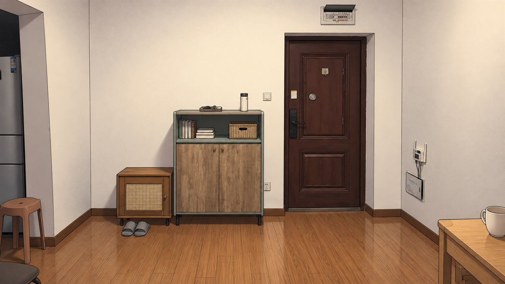
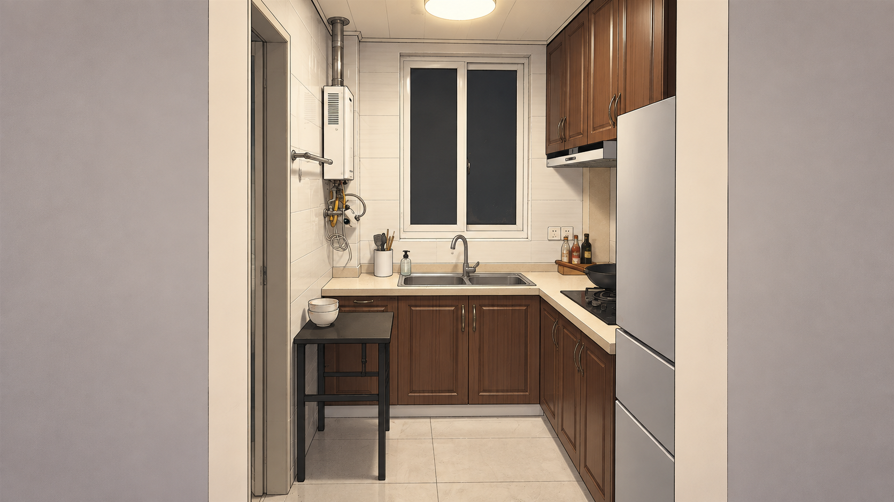
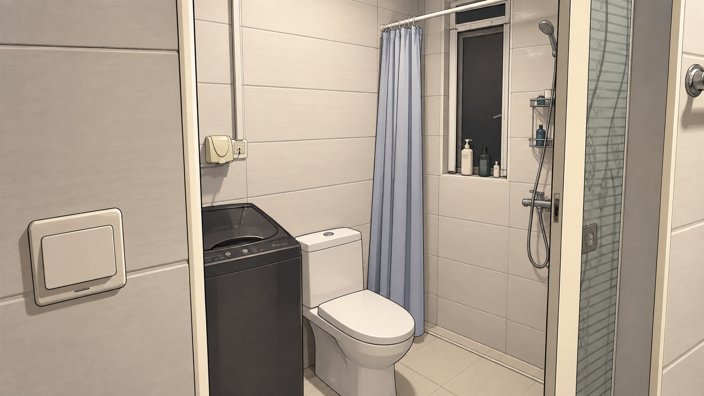
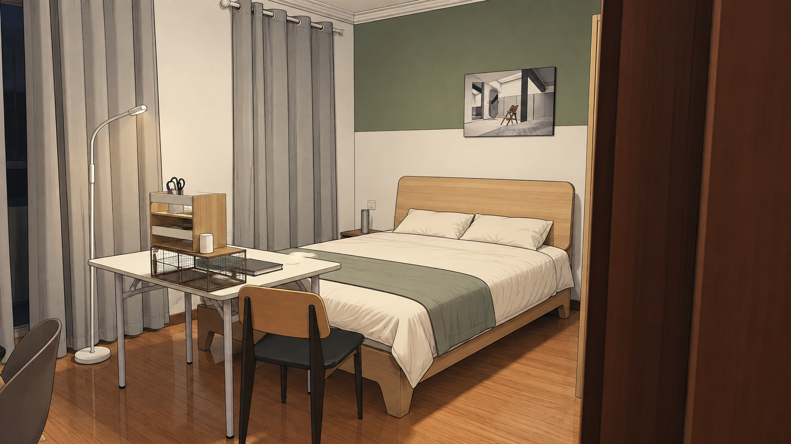
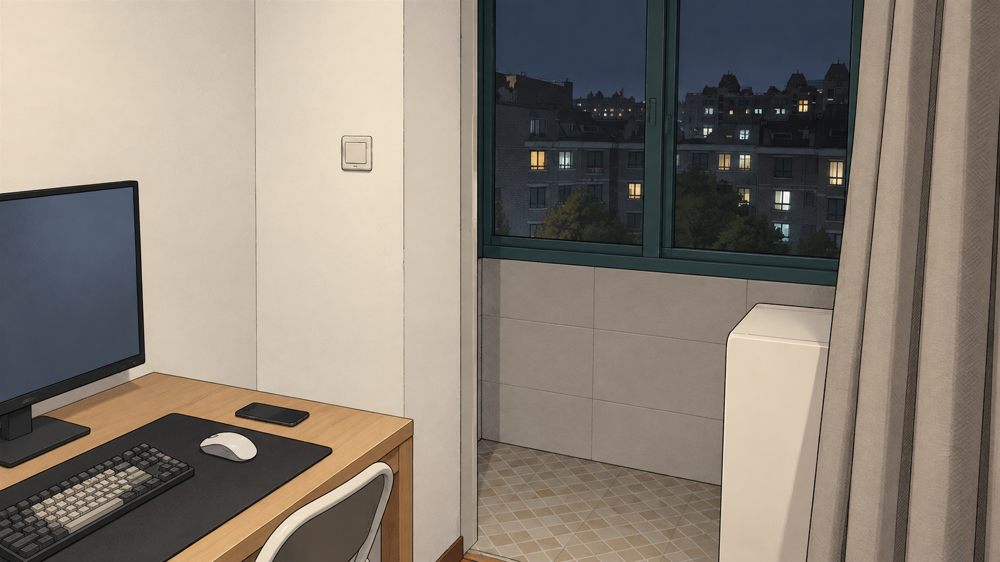

# 实拍住宅概念图 · 2026-09-25

本批为《无限异常》的住宅美术概念，共五张独立视角，使用内置图像生成工具生成。分辨率均为 1672 × 941 PNG。2026-09-26 已复制到 `assets/home/` 并接入 Godot 公寓场景版；本目录保留原概念与提示词。

## 本批约束

- 以用户实拍住宅为建筑依据，保留照片中可见的门窗、墙体转折、房间连接与主要家具位置。
- 去除散落包装、杂物和污渍，整理桌面与床铺、归拢线缆，让房间整洁、舒服，保留普通住宅的生活感。
- 沿用已讨论的克制彩色漫画方向：细墨线、准确建筑透视、低饱和自然色、适量平涂阴影。
- 分别呈现实际房间或局部视角，不将各房间合并到一张虚构空间图中。
- 本批不添加界面、标题、功能标牌或虚构设施。
- 依据照片可见关系绘制；未取得实测尺寸和完整平面图，概念图不代表已经验证的精确户型模型。
- 用户原始照片及生成工具输出均保留；本目录保存概念图副本。

## 图片

### 玄关

以照片 1 为主要构图，参照门左的两组柜子、门上方配电箱、左侧厨房入口和右墙设备。

### 厨房

以照片 7 为主要构图，保留狭长过道、后窗下水槽、右侧 L 形台面及近处冰箱、左侧热水器和卫生间入口。

### 卫生间

参照照片 8–9，保留洗衣机、马桶、浴帘、后窗、右侧淋浴设备及入口隔扇的位置关系。

### 卧室

以照片 12 为主要构图、照片 13 辅助，保留右后方床、绿白分色墙、灰窗帘分段、白桌和落地灯。

### 书桌与阳台

以照片 16 为主要构图、照片 15 辅助，照片 18 提供窗外环境；保留书桌、墙垛、阳台入口、灰窗帘、封闭窗及地面材质转换。

## 生成记录

每张图的完整提示词见 [prompts.md](prompts.md)。实拍参考的小尺寸副本位于工作区 `.local/home-photo-references/photo-01.jpg` 至 `photo-18.jpg`，仅做等比例缩小以兼容图像工具，原照片没有改动。

## 后续使用

正式接入游戏前按最终镜头裁切和分层，再核对可点击物体与门口的区域。暂不从这些透视概念图推断未拍到的墙面、门洞或尺寸。
