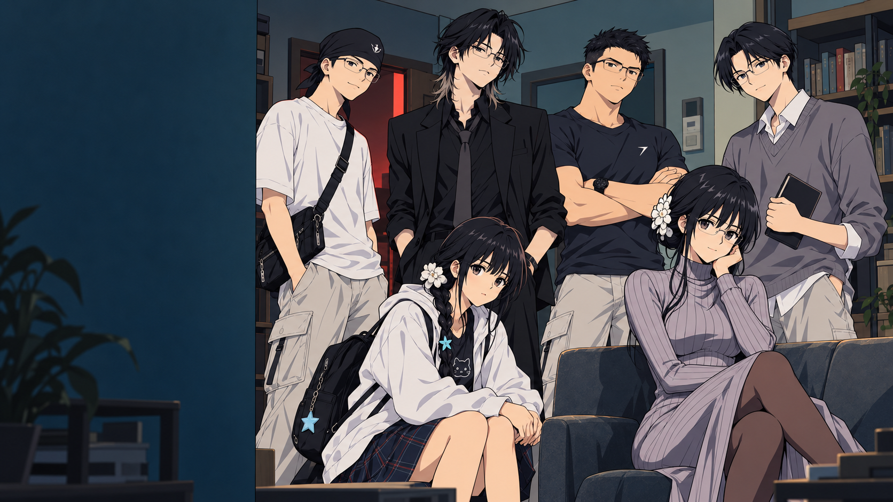

# 六人菜单 · 赛璐珞重绘 v02

状态：按2026-09-30最新反馈生成并接入本地制作预览，仍待用户美术评价。

用户指定本轮上传的轩轩四视图为画风标准，明确允许修改脸型。该指令优先于旧菜单及原人设的严格脸型保留规则；六人的姓名、服装与主要辨识配饰继续保留。用户参考原图留在本地参考目录，不随本次GitHub同步。

## 本次改动

- 统一为简练动画五官、清楚的发束轮廓、大块底色和硬边阴影；提亮肤色、白色服装和灰紫裙色，减少旧稿的棕灰暗调。
- 粉粉：保留半垂眼、冷傲和疏离感。
- 高哥／高博：睁眼、正视、平直眉线、稳重下颌，表现坚毅与可靠。
- 大东老师：自然睁眼、轻微友善笑意、放松姿态。
- 老王：专注睁眼、平静表情，持书作为本次菜单姿态。
- 七七：保留白外套、黑上衣、格纹裙、背包和海星，双手在膝边，避免和轩轩重复托腮。
- 轩轩：浅灰紫高领针织裙、黑丝、眼镜盘发白花饰，允许重新设计脸型和五官以贴近指定动画造型。

左侧保留菜单文字与按钮区域。背景仅作为菜单群像的构图衬景，不作为房间布局定案；开场房间仍需先确认统一平面，再继续分镜。

## 交付与验证

内置 image_gen 生成1次；完整提示词见 [prompt.txt](prompt.txt)。原图为1672×941，运行时沿用1600×900菜单显示。

- `menu-cel.png`：无UI主视觉，已替换本地 `assets/earth/menu.png`。
- `menu-in-game.png`：Godot实际菜单截图，含原有按钮和文字。
- `manifest.json`：版本状态、文件哈希及验证记录。
- `menu-before.png`：本地保留的旧稿备份，不列入本次GitHub提交。

本轮改动仅为菜单美术；五名战士动作、正式AVG与房间空间定稿的未完成状态没有改变。
