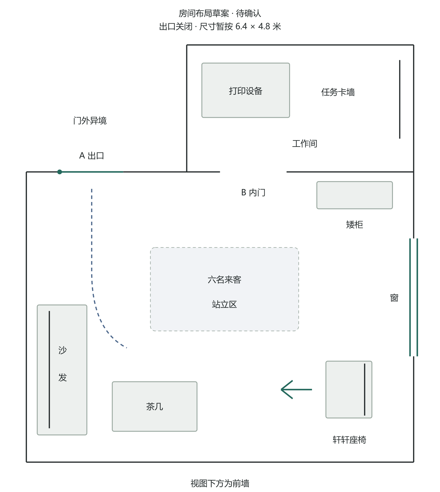
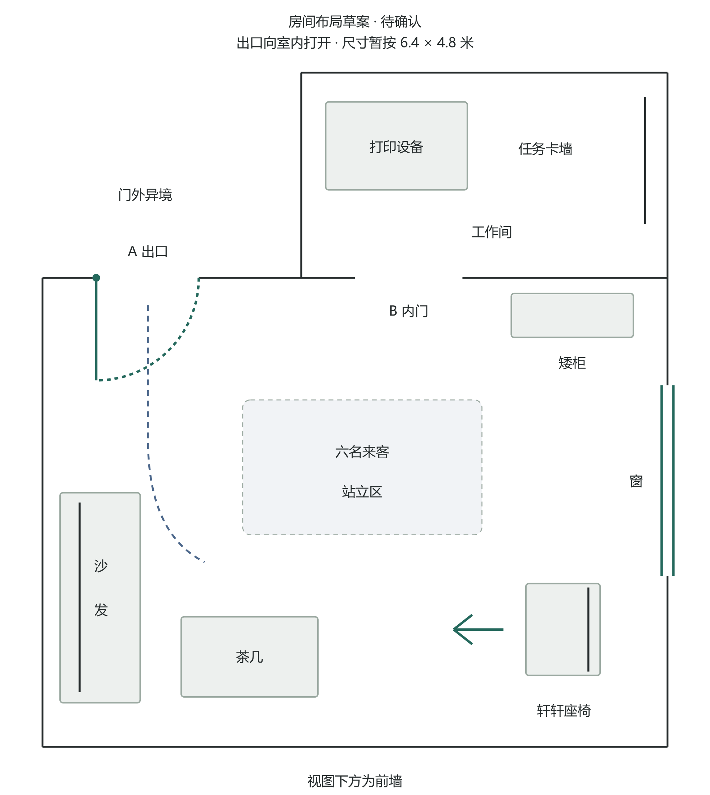

# 房间布局评审草案

**状态：待用户确认。** 6.4×4.8米、两扇门所在墙体、窗和家具的位置均为草案。上传归档不代表布局已获批准。

- `index.html`：下载后用浏览器打开，可切换出口开合状态。
- `source.html`：原始可交互示意源文件。
- `plan-closed.svg` / `plan-open.svg`：同一布局的矢量图。
- `plan-closed.png` / `plan-open.png`：供飞书和GitHub直接查看的静态图。
- `export-static.cjs`：从同一源图导出两种门状态，需要Node.js与sharp。
- [布局说明与后续制作顺序](../../../docs/room-layout-review-20260930.md)

本次只整理房间布局评审资料，没有制作新分镜、人物或上色，也没有改动游戏文件。原分镜的门位漂移和擅加餐厅不能作为正式场景设定。
