# 开发规划 V2.0｜无限异常重做：全流程游戏制作文档

版本：V2.2 美术方向确认 · 2026-09-28。用途：主创审阅与程序、美术、动画、剧情、数值、测试共同制作。本文包含38个界面及主要弹窗、1张总流程图、1张美术风格对比与选择图、5张场景构图板，共45张图片。用户已选择对比图左侧A的漫画平涂方向；图片用于制作说明，不代表新版已经实现。

读法：先读“游戏到底是什么”和总流程，再看两阶段规则及角色风格；UI01—UI38 给出每页打开后的样子和按钮去向。最后按制作顺序、数据表及验收用例落地。文内用“用户已确定”表示录音和后续明确要求；每房每批4人、百万房间循环运输和原四人永久伤亡已由用户明确；其余新增命名、关卡细节、公式、门槛和排期为首版建议，可在试玩后调整。

## 游戏到底是什么

一句话：你起初以为自己是通过监控管理四名战士的幕后指挥者，后来发现自己就是这座房间；你先把普通人训练成战士，再接管成群的房间，把士兵不断送入真实的星际战争。游戏由“房间里的小队养成”变成“战场下方经营基地群”的两阶段数值挂机游戏。

| 层面 | 本方案的具体做法 |
|---|---|
| 玩家主要操作 | 选择任务、召回整备、分配有限资源、选择装备能力；后期调整兵种比例、产能与科技。 |
| 玩家观看的内容 | 真实移动和攻击的角色与怪物、基地设施变化、越来越庞大的兵员流、金钻卡和文明卡。 |
| 前期的吸引力 | 四个普通人的性格与成长；每次回来都能清楚变强；更高关卡展示新的怪物和部件。 |
| 后期的吸引力 | 从关心一个人的生死转向面对大规模真实伤亡；把生产、补员、军队搭配和征服连成循环。 |
| 平台与交互建议 | 首版 Windows PC，鼠标为主，Esc返回/暂停，空格只在对话继续；战斗全自动。 |
| 明确边界 | 不做手操动作战斗、酒馆抽卡商店、PVP、随机词条海、恋爱女主、推理收容及旧版全金假结局。 |
| 挂机与离线建议 | 运行时可后台挂机；关闭游戏保存并暂停，不在首版做离线战斗和离线伤亡。 |

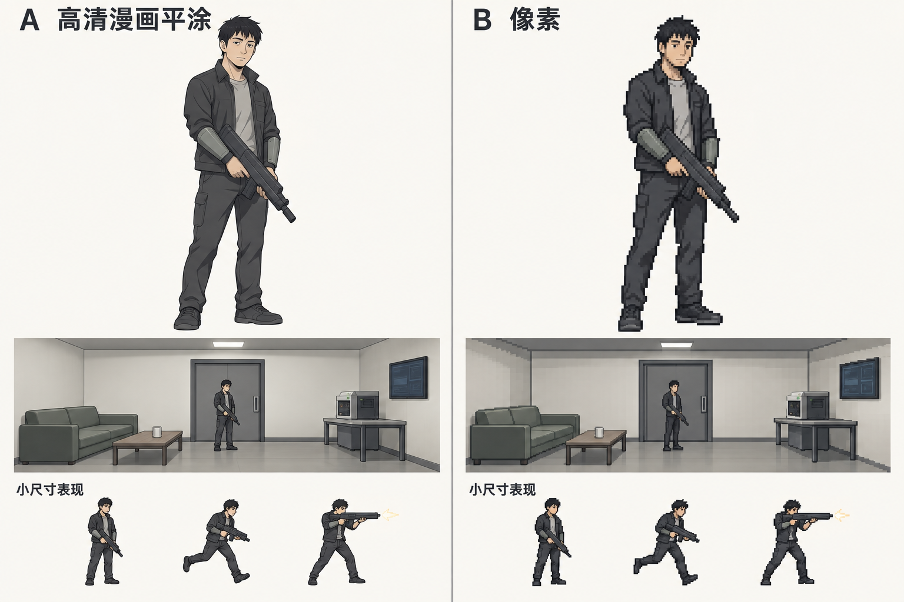

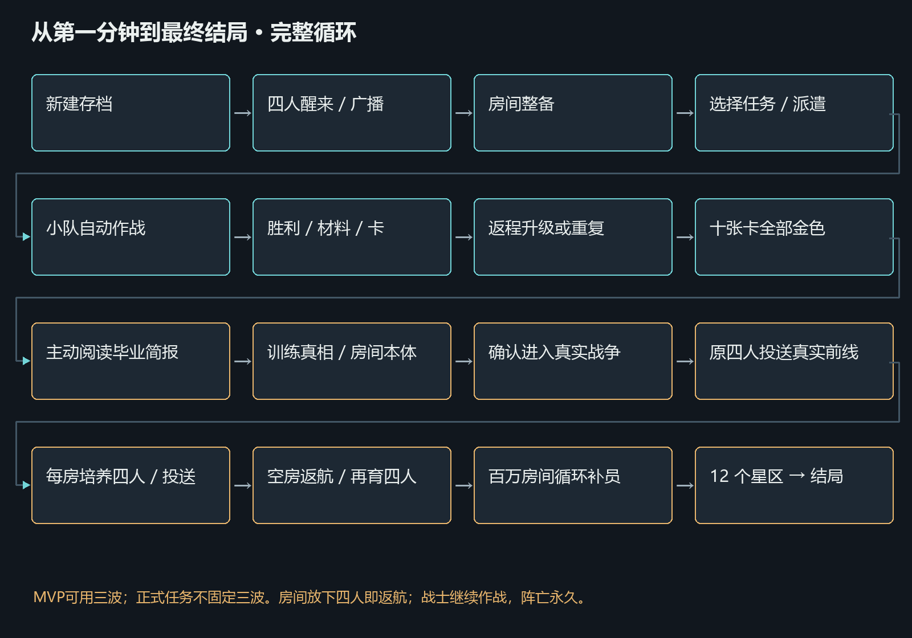

### 哪些来自你，哪些是本次补齐的设计

| 用户已确定 | 本次补齐为可制作规则 |
|---|---|
| 前期管理房间和队员，出战不能升级 | 首批4人，基地4级；所有一阶段成长都要求小队在基地。 |
| MVP十个任务、普通→金→钻卡 | MVP可用三波验证；正式版不固定三波。8胜金、25胜钻和十金毕业仍是候选数值。 |
| 前期死亡是训练，后期真实永久伤亡 | 前四人也是前线战士，阵亡永久；房间放下四人即返航，再培养下一批四人，循环往复。 |
| 后期大量基地出兵、逐星球征服 | 100万个房间持续往返投送；12星区仍为内容候选值，正式战役阶段数按任务配置。 |
| 用户已选择高清漫画平涂 | 以文首左侧A为准：正常成人比例、明确线稿、大块底色、少量硬边阴影；保留《杀戮都市》的普通人气质，角色与装备原创。 |
| 参考四款游戏与所给截图 | 参考经营节奏、信息排布和群体战斗表现；不默认搬进它们的全部系统。 |

三波只作为MVP验证用的简化任务结构，正式版不能把三波写死；正式波数、组成、首领阶段和结束条件由各任务配置。用户现已明确：原四人接管后就是战士，死了就死了。房间把四个人放到战场后立即离开，返回继续培养四个新的人；100万个房间持续往返运送战力。原先提出的留任教官安排撤销。“十张金卡后毕业”、8胜金/25胜钻等其余数值仍属未锁定建议。

## 玩家全流程：第一分钟到通关

| 阶段 | 玩家看到什么 / 做什么 | 系统交付与结束条件 |
|---|---|---|
| 首次启动 0—2分钟 | 空房监控变亮，四人醒来；玩家通过广播欢迎他们，门被打开。 | 完成开场，UI05亮起任务门；仅显示一条当前目标。 |
| 第一次任务 2—5分钟 | MVP选择M01，确认四人，观看跑动与攻击，第三波出现首领；正式内容依任务配置。 | 首次卡与100积分/3合金；返程结算引导进入体质页。 |
| 第一次变强 5—8分钟 | 给前排升级体质、打印一件装备，看到属性差值和外观改变。 | 再次打M01快于第一次；开放自动重复与2倍速。 |
| 形成循环 8—30分钟 | 推进M02/M03，遇到护甲怪，回房更换装备；基地T2外观变化。 | 玩家会主动选择刷材料还是挑战新关，第一次得到金卡。 |
| 中段成长 | 推进M04—M10，解锁第二能力槽，补齐十张金卡。 | 四位角色各有3段对话；进度栏持续告诉玩家还差哪些卡。 |
| 毕业转折 | 大屏幕召集四人；揭示训练和房间本体；接入全世界同类基地。 | UI38说明原四人进入真实战场、阵亡永久，以及房间返回继续培养四人的循环。 |
| 战争入门 | P01演示原房间送下首批四人后空载返回，再培养/运送第二批；先后两批战士独立作战。 | 征服P01得到文明卡；P02开始自行处理产能和伤亡。 |
| 战争扩展 | 12个星区依次解锁，敌方编队改变；战败退守积攒资源再来。 | 看得懂每一名士兵从生产到出场到阵亡的去向。 |
| 终局与继续 | P12后播放主线结局，人类掌握战略文明网络。 | 返回战争驻防或历史训练补钻卡；一个主线结局，没有隐藏真结局门槛。 |

首版节奏目标为第一阶段约2—4小时、完整主线约8—12小时有效游戏时间。这是待实测的设计目标，不是已验证时长。1倍与2倍速共用游戏内时间与收益，2倍同时加快伤亡、生产、训练和技能。章节间没有强制现实时间等待。

## 第一阶段：训练小队规则

### 一次任务如何开始和结束

MVP暂用三波：两波普通敌人、一波首领。正式任务不固定三波，使用waves列表、阶段目标和完成条件驱动。开始前四人满生命，波间仅存活者恢复；倒下者本次任务不归队。run_id唯一；MVP波1/2/3权重暂为20%/20%/60%，正式版使用每波reward_weight并校验总和100%。已完成波次独立入账，合金余数在最后一个完成节点补齐。首胜配方和卡进度只在该任务所有目标完成时发放，不能写if wave==3。

召回放弃当前未完成波次，保留已完成波奖励，四人免费恢复。全灭同理，自动重复和自动下一关都停止，避免不断失败却不知道。胜利可返程、重复本任务或进入下一关；重复前在幕后完成训练复位，四人齐全后再开下一局。没有体力、没有复活付费，也没有由死亡扣除等级的惩罚。

在外出战时：体质、武器升级、换装、能力学习、打印、设施升级、批量训练全部不能提交。界面可以查看，并直接提供“召回小队”入口。召回确认后回到原来想升级的页面，减少来回找按钮。第二阶段的基地经营允许在战斗中执行，属于明确不同的管理规则。

### 自动战斗怎么表现、怎么算

采用固定高清背景加独立单位序列帧。单位在二维地面坐标上移动，视觉为斜俯视；近战走到射程、远程在射程内站定。攻击动画不因受击中断；伤害触发点由数据时间决定，不能靠动画帧率决定。受击只做颜色闪白、小幅血液、数字和音效。死亡完成一次倒地动作后移除战斗碰撞，尸体淡出。

| 规则 | 第一版定义 |
|---|---|
| 目标选择 | 优先可攻击的敌方治疗者，其次最近目标；同距离按稳定单位ID选，避免每帧换目标。前排通过更靠前的出生位置承担伤害，不添加复杂仇恨系统。 |
| 寻路范围 | 开放战斗平面，只绕行不可走的场景边界；不做地图探索或复杂迷宫。背景装饰不能阻塞主战线。 |
| 近战范围 | 标准48逻辑像素；远程360逻辑像素；世界坐标按1600×900参考分辨率标定，分辨率变化不改变逻辑距离。 |
| 伤害 | 单次伤害=max(1, round(攻击×技能倍率×100/(100+护甲)))。不做暴击、命中与闪避随机。 |
| 技能 | 固定冷却自动施放；范围技能最多命中6目标；同源护盾只保留最大值。治疗优先生命比例最低的存活友军。 |
| 无硬直 | 受到伤害不重置攻击计时、不中断技能、不推退；死亡才终止动作。 |
| 波间处理 | 清空弹道和短期增益；幸存者满血；等待2秒展示波次，再生成下一波。 |
| 自动逻辑 | 重复刷卡时停在选定关；自动下一关按序前进到M10，失败停止；设置不偷偷改成另一种。 |

### 十个任务内容表

| 任务 / 场景 | 首领与小怪 | 参考战力 | 整局积分 / 合金 | 首胜解锁 |
|---|---|---|---|---|
| M01 废弃地铁 | 节肢幼体 / 蜈节行者 | 280 | 100 / 3 | 标准武装 |
| M02 封闭公寓 | 空壳住民 / 回声母体 | 400 | 130 / 3 | 电弧步枪 |
| M03 高架桥底 | 板甲犬 / 磁脊犬王 | 560 | 170 / 4 | 磁脊盾；基地 T2 |
| M04 地下商场 | 碎镜偶 / 镜壳主机 | 740 | 220 / 5 | 碎镜甲 |
| M05 旧城区天台 | 浮游眼 / 百眼灯塔 | 960 | 280 / 6 | 反射甲片模块 |
| M06 冷冻仓库 | 冻壳体 / 霜棘搬运体 | 1240 | 350 / 7 | 基地 T3；第二能力槽 |
| M07 海边泵站 | 寄生壳 / 潮汐簇 | 1580 | 430 / 8 | 再生膜模块 |
| M08 旧观测台 | 观测卫士 / 环首观察者 | 1980 | 520 / 9 | 聚束轨炮 |
| M09 通信塔群 | 信标偶 / 信号巨人 | 2440 | 620 / 10 | 信号屏障模块 |
| M10 零号试验场 | 四类训练残影 / 门卫 | 3000 | 740 / 12 | 基地 T4；毕业档案 |

十关每关至少一种独立首领轮廓；小怪控制在8个基础家族，通过配色、体型和少量附属件变体扩展。前9关不明说模拟；M10的网格与设备暗示只提供可回想的伏笔。每关不重复写一套UI：上方波次和资源、中央战斗、下方控制完全复用UI09。下面逐场景说明固定背景、可战斗区域和视觉差异。

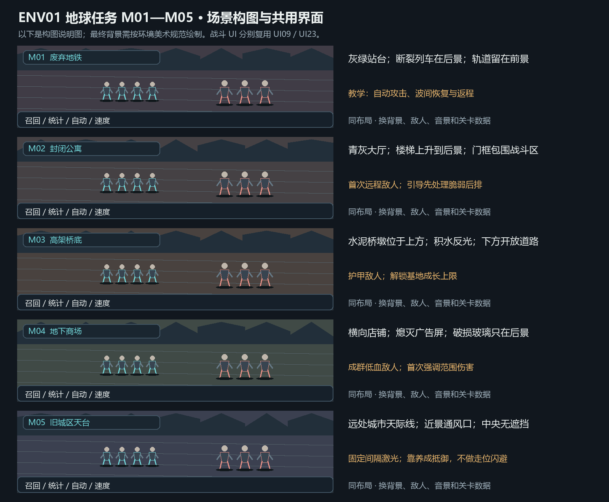

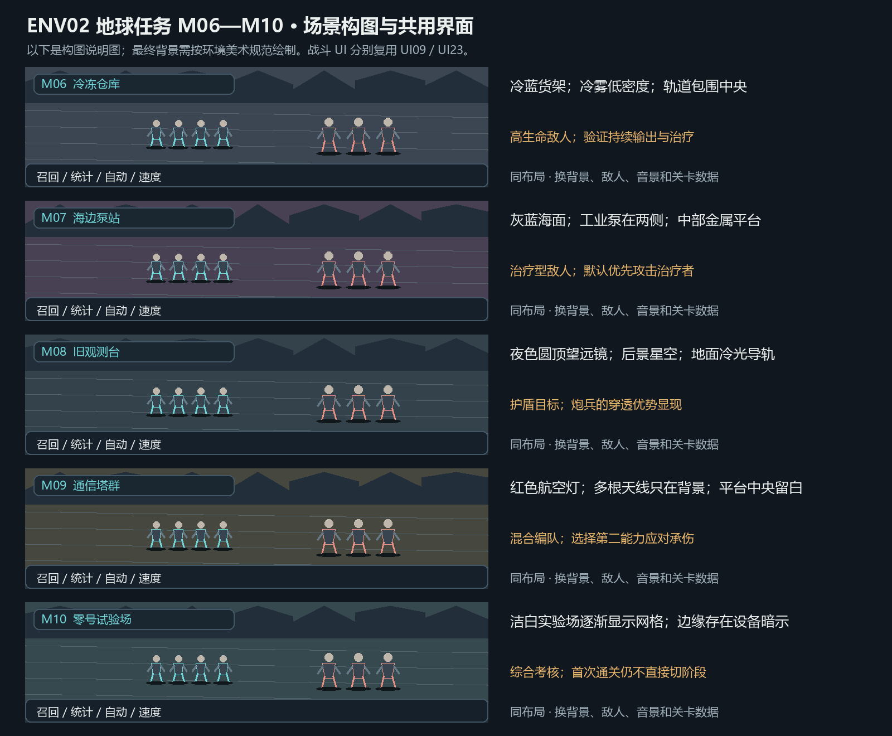

## 数值和经济：能照着做的起始表

### 角色、设施、装备与能力

| 角色 | 基础生命 / 攻击 / 护甲 / 间隔 | 成长定位与固定武器 |
|---|---|---|
| 乔越 | 240 / 22 / 12 / 1.2秒 | 盾卫；短刃+盾；生命高，优先承担前排伤害。 |
| 周霁 | 160 / 28 / 5 / 1.0秒 | 射手；步枪；稳定单体输出。 |
| 林衡 | 200 / 42 / 8 / 1.8秒 | 炮兵；重轨炮；范围/穿透输出。 |
| 贺维 | 175 / 14 / 5 / 1.5秒 | 医疗；修复器；每8秒治疗最低血量友军基础40生命。 |

体质、武器、防具各Lv.1—20，Lv.1使用基础值，增量乘以(L−1)。基地T1上限5、T2上限10、T3上限15、T4上限20。体质每升一级加基础生命8%、基础攻击3%；武器每升一级加角色基础攻击10%；防具每升一级加护甲6、基础生命3%。所有这些提升采用相加而非互相相乘，避免每次增加系统都使旧数值失控。Mk代表配方阶级：Mk.01无额外属性，Mk.02加10攻击或10护甲，Mk.03加20攻击或20护甲，Mk.04加30攻击或30护甲；武器只加攻击、防具只加护甲。

特殊能力每种最高Lv.5。四人的职业技能固定占第一槽，基地T3开放第二槽从已解锁怪物模块中选择。每名角色只做1个固定武器家族；高级外形改变武器挂件与颜色，复用基础动作。库存保留明确的物品实例ID与等级，不做随机品质连环抽取。

| 能力 / 来源 | Lv.1效果与冷却 | 每次升级增量 / 适用范围 |
|---|---|---|
| 护盾冲击 / 乔越初始 | 12秒；120%攻击伤害，获得30护盾4秒 | 伤害倍率+20个百分点、护盾+12；单体。 |
| 连锁电击 / 周霁初始 | 10秒；依次命中3敌人，各80%攻击伤害 | 每段+15个百分点；目标不足时不重复命中。 |
| 穿透炮击 / 林衡初始 | 14秒；直线上最多6敌人，各150%攻击伤害 | 每级+20个百分点；按目标原护甲的50%结算。 |
| 紧急修复 / 贺维初始 | 8秒；治疗生命比例最低友军40生命 | 每级+15治疗量；已倒下目标无效。 |
| 反射甲片 / M05 | 被动；受到普攻时反伤实际伤害的5% | 每级+2个百分点；反伤不触发反伤。 |
| 再生膜 / M07 | 每10秒恢复自身最大生命4% | 每级+1个百分点；角色倒下后停止。 |
| 聚束模块 / M08 | 16秒；下一次普攻附加100%攻击激光伤害 | 每级+20个百分点；与武器动画共用发射点。 |
| 信号屏障 / M09 | 18秒；全体存活友军获得20护盾4秒 | 每级+8护盾；与其他护盾取较高值。 |

| 项目 | 成本公式 / 固定成本 | 说明 |
|---|---|---|
| 单人体质 L→L+1 | 35 + 15×L 积分 | 例如4→5为95积分；批量与单人同价，批量需30秒，换来同时操作四人。 |
| 武器升级 L→L+1 | 50 + 30×L 积分；1+floor(L/3)合金 | 装备等级沿具体物品保存，更换不会转移投入。 |
| 防具升级 L→L+1 | 40 + 25×L 积分；1+floor(L/4)合金 | 费用展示在确认按钮上。 |
| 能力首次学习 / 后续升级 | 首次180积分/4合金；升级180×当前级积分/4×当前级合金 | 职业技能初始免费Lv.1；第二槽模块从Lv.1学习。 |
| 制造 Mk.01/02/03/04 | 100/180/260/420积分；4/6/8/12合金 | 固定成品，无抽取概率；首套四人标准装备随新档赠送。 |
| 基地 T2/T3/T4 | 500/1600/4000积分；12/35/80合金 | 分别要求M03/M06/M10首胜。 |
| 分解 | 返还制造合金50%，向下取整 | 不返还积分或升级成本；禁止分解唯一可用武器。 |
| 新档资源 | 150积分、8合金；标准装备四套 | 第一局失败也可免费重试M01。 |

### 战力、关卡敌人与第一次调参

战力仅为提示，不参与实际伤害。单人战力=round(生命/10 + 每秒普攻伤害×3 + 护甲×2 + 每秒治疗量×2 + 能力等级合计×15)，队伍为四人相加。公式只求能解释成长，不能保证不同编制在每个关卡相同胜率；UI注明“参考战力，敌人类型仍影响表现”。UI图片中的数值是说明布局的示例快照，最终由数据表和公式实时生成，不应硬编码图片数字。

以下仅为MVP三波测试数据：M01小怪生命70/攻击8/护甲0/间隔1.4秒；首领450/18/5/1.6秒；4小怪→6小怪→首领+2小怪。任务系数=参考战力/280，生命乘系数，攻击乘系数的0.75次方；小怪护甲=5×(关卡序号−1)，首领再加5。MVP后续普通波6/8人，第三波首领+4随从。正式任务重新编排可变长度的波次、敌军批次、阶段目标与奖励权重；不能只把MVP第三波反复复制。

算例：基础乔越22攻击对5护甲敌人，伤害round(22×100/105)=21；升级一级体质后基础攻击增0.66，UI显示约23，内部保留小数，在结算伤害时取整。全队基础普攻每秒约79点，M01的总敌方生命约1290，因此纯输出下限约16秒；计入跑动、选目标和波间过渡，目标完整任务时长45—75秒。首次验证发现相差过大时优先调敌人生命和出兵节奏，不通过隐藏伤害修正欺骗玩家。

MVP经济试算按10关、每关8次胜利估算：80次完整通关，若每局45—90秒则纯战斗60—120分钟。这个估算只适用于MVP三波测试，不作为正式版时长承诺；正式版按各任务实际战斗段、回房成长与刷卡目标重测。金卡/钻卡不加战力，钻卡为额外收集目标。

## 第二阶段：基地群、真实伤亡与星际战争

### 转阶段的保留与变化

原四人保留各自身份、体质、装备和能力，成为第一批真正投送到前线的战士，既不是教官，也不只是被转换成兵种模板。放下后他们独立参战，使用与后来新人相同的永久伤亡规则；死者进入阵亡记录，房间不会复活或复制他们。原房间继续存在，空载返程后接收并培养下一批4名新人，再次运到战场。房间是持续运转的培养与运输载体，具体战士是一批批会消耗的战斗人员。

战争的补给/科研与训练积分/合金分别保存，不能互换。进入第二阶段时原四人作为首批战士迁移一次；500补给可作为首版测试初始资源，不再额外凭空发200人替代首批。接入百万房间网络后，其他房间各自按培养/运输状态继续投送。历史训练回放仅为档案模拟，不能复活真实已阵亡人员，也不能清除战争伤亡。

### 一场战争的明确规则

正式战役阶段数、敌军批次和结束目标按PlanetDef配置，不固定为三波或五波；原5波仅可保留为早期战争样例。实际补员发生于房间抵达并卸下该批4人时。培养完成不等于立即出现在战场；满载去程、四人下车、空房返程都有独立状态。前一批仍活着不阻止同一房间送来下一批。画面最多呈现我方60/敌方60个详细实例，百万房间及其部队以队伍、运输批次和战区统计汇总，实例上限不得冒充全军总数。

玩家战区耐久初始1000。敌人穿过左边撤离线，每名每秒造成10点耐久伤害，直到被击杀；耐久为0判战败。士兵生命耗尽从前线删除并累计永久伤亡；没有波间全员回满血，幸存者携带现有生命进入下一波，医疗单位负责恢复。波间仅恢复基地耐久50，上限1000。整场征服后幸存者进入驻防并在10秒内治疗至满；这个驻防恢复不复活死者。

前线没有存活士兵时展示下一批在途房间的到达时间；房间仍按各自培养和运输循环工作，不以全军阵亡作为下一批开工条件。若某个房间已满载，则等待航线容量后出发；它不能一边满载在途一边开始培养下一批。关掉自动投送只让完成培养的房间等待，不删除任何人。主动战场撤退另行把幸存者撤到集结区；日常空房返航不携带已经部署的战士。

胜利条件由当前星球战役配置决定，奖励按阶段权重入账；撤退与失败保留已完成阶段收益。失败回上一已占领战区安全驻防，P01失败回轨道安全区，暂停自动进攻。在途房间改投安全集结区并保留当前批次身份，不把他们再生成一次。基础培养与往返渠道继续运行，资源为0也能逐批培养并运来新人；驻防被动收益仍是待测试的经济建议。

### 产能、兵种与科技起算表

| 系统 | 首版规则 |
|---|---|
| 房间网络与群组 | 100万个房间是用户明确的网络规模；UI按战区和工作状态分组管理，不能只剩4间房。群组数量与可调度范围另做制作参数，不限制世界总房间数。 |
| 单房循环 | 接收4名新人→培养4人→满载去程→放下4人→空载返程→下一批。每次固定4人；速度升级缩短时间，不把一房容量改成6人/8人。 |
| 首版计时建议 | MVP单房培养30秒、去程10秒、下车2秒、返程10秒，共52秒一轮；正式时长待测试。群组升级缩短培养时长，不取消往返。每分钟投送率=60×4/(完整周期秒数)。 |
| 每批编制建议 | 每房四个位置分配职业，默认1盾卫/1射手/1炮兵/1医疗；同职业可重复。不同房间群使用不同四人方案形成全军占比。每批都有room_id、cohort_id和4个新unit_id。 |
| 新兵基础 | 盾卫HP180/ATK12/甲20/间隔1.2；射手90/20/5/1.0；炮兵100/35/5/2.0；医疗85/8/5/1.5且8秒治疗30。 |
| 科技 | 武装/防护/医疗每级对应属性加8%基础值，物流每级缩短去程与返程基础时长各3%，最低不低于各自基础时长的40%。Lv.0—20，L→L+1成本=40+60×L科研点。 |
| 驻防收益 | 最高已占领星球P序号=n：每游戏分钟30×n补给、3×n科研；轨道区0收益但仍能免费产兵。 |
| 培养与科技生效 | 属性在每批开始培养时锁定，运输参数在出发时锁定；升级影响下一批/下一趟。原四人保留已成长属性，后续四人按当时培养标准生成，不继承前一批身份和伤亡。 |
| 防无限资源 | 没有卖兵、兵换积分、基地降级退款；暂停停所有计时；历史训练不能同时生产战争资源。 |

### 完整十二星区表

| 星球 / 文明 | 敌军特点 | 强度系数 | 整局补给 / 科研 | 建议初试比例 |
|---|---|---|---|---|
| P01 潮汐矿卫星 / 潮汐掘进体 | 采矿群与大型钻头 | 1.00 | 300 / 20 | 盾30 射40 炮20 医10 |
| P02 玻璃苔原 / 晶原议会 | 脆皮高伤晶体兵 | 1.22 | 420 / 30 | 盾40 射30 炮20 医10 |
| P03 沉降环带 / 磁环共同体 | 护盾与重甲军阵 | 1.48 | 600 / 50 | 盾30 射30 炮30 医10 |
| P04 双日沙海 / 沙脊王庭 | 大量高速冲锋兵 | 1.80 | 800 / 70 | 盾40 射40 炮10 医10 |
| P05 菌海大陆 / 共生群落 | 持续再生的群体 | 2.20 | 1050 / 90 | 盾30 射20 炮40 医10 |
| P06 潮锁都市 / 深层市民 | 远程炮台与步兵 | 2.68 | 1350 / 120 | 盾40 射30 炮20 医10 |
| P07 碎月铸场 / 铸月联盟 | 精英重装与少量炮兵 | 3.27 | 1700 / 150 | 盾30 射20 炮40 医10 |
| P08 黑曜雨林 / 影梭文明 | 分散高伤射手 | 3.99 | 2100 / 190 | 盾40 射40 炮10 医10 |
| P09 恒风海盆 / 风帆联邦 | 多段护盾与持续火力 | 4.87 | 2600 / 230 | 盾40 射20 炮30 医10 |
| P10 空壳环城 / 环城继承者 | 混合兵种与医疗支援 | 5.94 | 3200 / 280 | 盾30 射30 炮30 医10 |
| P11 红移圣所 / 红移守望者 | 高血精英最后防线 | 7.25 | 3900 / 340 | 盾40 射20 炮30 医10 |
| P12 中枢星域 / 终端协定 | 前十一战区编制组合 | 8.85 | 5000 / 420 | 盾30 射30 炮30 医10 |

P01敌人基础生命100、攻击12、护甲8、间隔1.4秒；精英生命×4、攻击×1.5。普通波各30人，最后一波20普通+1精英；星球系数作用于生命与攻击，护甲按8+2×星球序号增长。P12是最高控制节点的会战；十二星区是叙事上的战略关键区域，并非宣称宇宙只有十二个星球。敌方从5个家族复用不同军阵与颜色，最终首领另做独立外形。

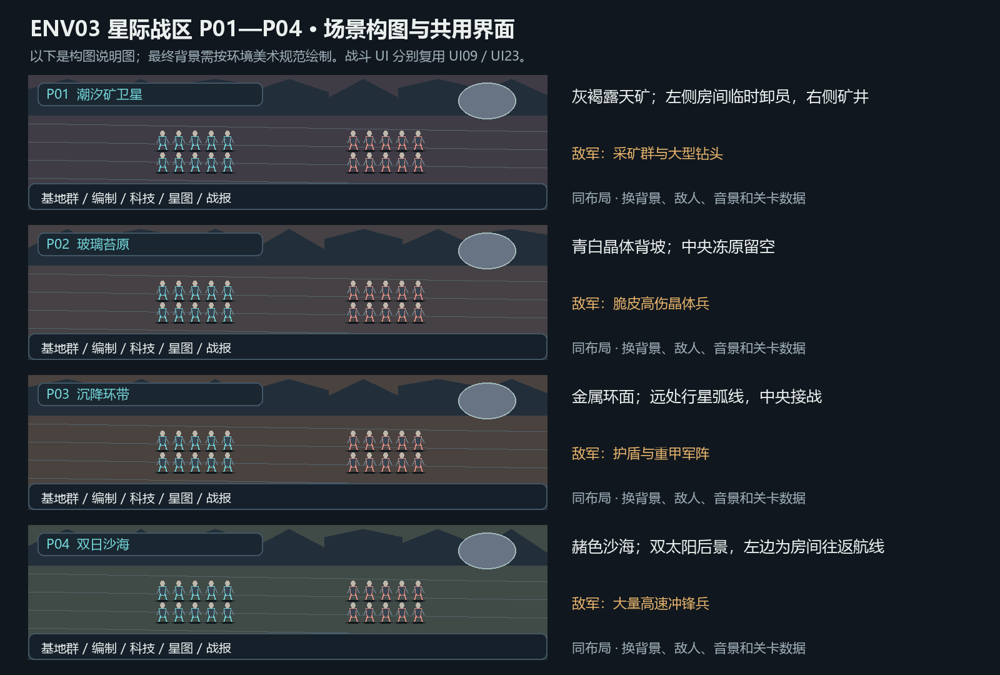

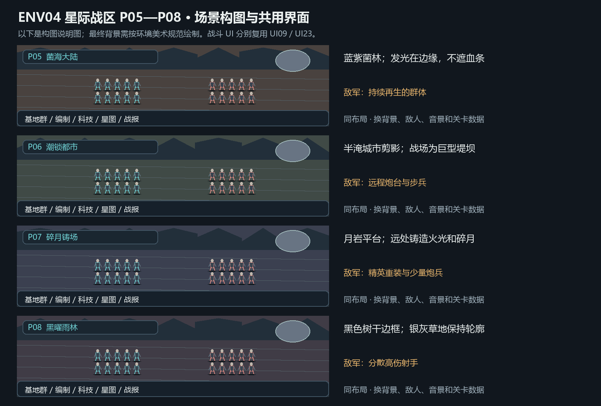

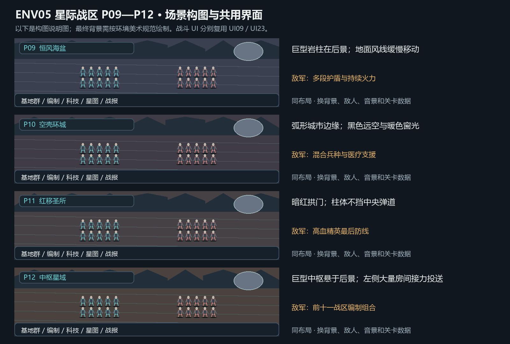

## 剧情、人物与已确认的漫画平涂美术规范

### 已选方向与原创角色制作标准

视觉依据见文首对比图左侧A。用户选择的是漫画平涂的整体方向，不是批准把示例人物直接当成四人的最终定稿。原四人重装风格板撤下，角色身份与职业设定保留，外形按此处规范重绘。原主场景图同样不再用作材质与光影依据。

采用高清2D漫画线稿加平涂：明确、干净的外轮廓，内部结构线更轻；每种主要材质以一块底色加一档主要硬边阴影为起点。保留《杀戮都市》方向的正常成人比例、普通人的面孔与不安表情，不做精英军人模板。角色以黑灰衣服和少量功能装备为主，靠脸型、年龄、体态、衣领袖口和武器轮廓区分；减少小零件、复杂绑带、金属反光、渐变和发光装饰。人物、装备和怪物均为原创。

四人的立绘、战场小人和动作必须共享比例、线粗、色板、阴影方向与武器结构。职业识别以乔越的盾、周霁的步枪、林衡的重武器、贺维的医包为主，辅以少量实色标识；不能靠满身灯带区分。先验收一名角色的站立、跑动、攻击在实际游戏尺寸下的清晰度，再扩展四人。对比图中仍有柔和明暗的部分只是示意，正式资产继续收敛色阶；不得把独立生成图直接拼成一套动画。

| 角色 | 叙事个性与台词方向 | 外形 / 武器 / 动作重点 |
|---|---|---|
| 乔越，24岁，快递员 | 先质疑规则，危险时先挡在前面。示例：“先别问出口，我看见它过来了。” | 短发、瘦而结实；短刃与盾；前倾跑、格挡姿态，但格挡不造成攻击硬直。 |
| 周霁，30岁，电工 | 会观察设备异常，逐渐发现房间一直在回应。示例：“电没断，断的是外面的声音。” | 偏瘦、稍长黑发；双手步枪；射击后不夸张甩枪。 |
| 林衡，38岁，机械工 | 用实用主义缓和恐惧，对打印技术兴奋。示例：“能打出来，就能拆明白。” | 宽肩、短胡茬；重轨炮；低重心跑动、双手稳枪。 |
| 贺维，45岁，急救员 | 坚持记住每次倒下的人；揭示训练后仍追问前线代价。示例：“如果下次是真的，谁来把他们带回来？” | 眼镜、普通中年面貌；修复器与医疗包；检查设备、短促治疗动作。 |

### 剧情分场与触发

| 场次 | 触发 | 画面与信息 | 需要制作的文本量 |
|---|---|---|---|
| S00 苏醒 | 新档 | 4人坐起，广播自称管理端；宣布死亡与重建的表层规则。 | 12句广播/回应，约90秒。 |
| S01 第一次返回 | M01首胜 | 房间灯光亮起，打印机产出第一件战利品；队员接受任务循环。 | 四人各2句，8句。 |
| S02 设备疑问 | M05首胜 | 周霁注意没有指挥者的房间；对话可选择语气，不分主线结局。 | 四人各4句，16句。 |
| S03 门后的网格 | M10首胜 | 怪物消散时暴露模拟网格；广播短暂停顿。 | 6句，保留悬念。 |
| S04 毕业 | 十张金卡 | 解释训练真相与房间本体；四人走下房间投入前线，镜头留在返航的空房里，新一批四人进入。 | 约30句，3—4分钟，可分段翻页。 |
| S05 真实伤亡 | P01首次阵亡 | 房间系统显示首个真实阵亡记录；人物对白仅对仍存活者触发，不能让已经死去的贺维继续说话。 | 4句，字幕不阻挡战斗，可回看。 |
| S06 星海扩张 | P04/P08首胜 | 房间网络与人类文明的扩张代价；不引入陌生女主。 | 每段8句。 |
| S07 终局 | P12首胜 | 各地房间亮起，人类接管战略文明网络；回看总伤亡与文明档案。 | 约12句，90秒。 |

世界观补齐：数十年前人类获得外星遗留的传送与制造技术，秘密建设训练房间网络。外部文明为有限的可居住区域、可采能源和稳定航路竞争，人类选择先发扩张。“热饱和”保留为角色对宇宙困境的俗称，不在设定中将未经解释的物理概念当科学定论。中场前广播的死亡/复制人说辞是一种训练欺骗，揭示时必须清楚承认，不能再写出真的死了又克隆的冲突剧情。

### 环境、卡牌、音效与动画

| 资产 | 具体制作要求 |
|---|---|
| 基地 | 真实可居住的小型军事别墅内部；用明确透视和简洁线稿表现沙发、桌椅、门、打印台、训练舱和监控；墙地面留大块安静色面，不铺满装饰和材质噪声。 |
| 怪物 | 生物与人工结构融合，必须有可读攻击部位；10首领各有轮廓记忆点。不要仅在同一人形上换头。 |
| 卡牌 | 22张漫画平涂插画：训练10张、文明12张；允许更多构图信息但共用线条和色阶。金/钻用边框颜色及少量状态动效区分，不改变主体画风。卡中文字独立绘制。 |
| 战斗背景 | 10地球+12星球；前景、地面、后景3层；中部交战区对比度低，背景不能抢人物和血条。 |
| 反馈 | 武器各一套射击/挥击/命中/死亡音；血液可简化；掉落金币不满屏飘，结算集中显示。 |
| 音乐 | 基地低频环境声+轻微设备声；地球紧张但可久听；战争节奏更强；最终回到空房设备声。每阶段至少2首轮换。 |

序列帧建议：角色源帧256×256，重要首领512×512，8—12fps动作播放；战斗模拟与渲染保持独立，屏幕目标60fps。首批验证每人待机6帧、跑动8、普攻10、技能12、倒地8，共44帧；4人176帧。镜像可用于对称身体，枪口、盾和文字不能直接镜像导致左右手错位，必要时补左右版本。最终用透明PNG与图集，统一脚底锚点。

AI动作视频只能作为动作原料：固定机位、单角色、明确动作起止；抽帧后逐帧检查五官漂移、肢体多生、武器变形和尺寸跳变。抠图需要边缘去白、半透明色污染处理、阴影单独层。先用一名角色和一个怪物完成“跑—停—攻击—死亡”循环，再决定是否规模化；若质量不稳，转人工关键帧或可靠的逐帧补间，不把不稳定视频直接塞进游戏。

## 全局 UI 设计规范

UI配合漫画平涂采用简单深灰面板、规整文字与清楚的状态色；青色可操作、暖金奖励、红色损失，取消金属质感、泛蓝光和多层装饰边框。已有UI线框图保留布局与交互作用，不要求把线框颜色原样复制成成品。前期基地主画面约占80%；战斗顶栏约10%、底栏约16%；后期经营抽屉不超过55%，保留可见战场。

| 项目 | 规格与行为 |
|---|---|
| 参考画布 | 1600×900，正式按1920×1080制作并等比适配；最小1280×720。宽屏保持战场扩展，核心按钮不贴到不可见边缘。 |
| 字号 | 参考画布：页标题32、段标题26、正文22—24、辅助18—20。小于18的文字不用来承载重要规则。 |
| 按钮 | 主要按钮≥160×52，间距≥12；每个面板一个主动作。禁止把整个卡片同时做成选择和立即购买。 |
| 页面返回 | Esc先收起最上层弹窗，再返回来源页，最后打开暂停。关闭时保留选中角色、任务、滚动位置。 |
| 信息顺序 | 我在哪里→我拥有多少→我可做什么→做完改变什么→代价与风险→下一步。 |
| 动效 | 购买数值0.25秒滚动，升级发光0.4秒；任务结算奖励先出现再显示下一步，自动继续倒计时5秒可随时取消。 |
| 禁用解释 | 灰按钮旁写具体条件，如“还差80积分”“需要T2”“召回小队后可升级”；支持点击提示去向。 |
| 输入锁定 | 提交中的按钮显示处理中并禁用重复点击；存档事务完成再显示成功；每次只能有一个全屏确认框。 |
| 无障碍 | 状态配文字与图标；支持大字和关闭闪烁/血液；说明不依赖纯红绿颜色。 |

以下38张UI图中的角色和卡画轮廓只作布局占位；最终视觉以文首左侧A的漫画平涂方向及美术规范为准。每个窗口的入口、状态、操作结果和返回路线按图文共同实现；共用弹窗和错误状态继续复用，不因美术更新改动已确认玩法。

## 逐界面制作：启动与第一次进入

### UI01 标题 / 进入游戏

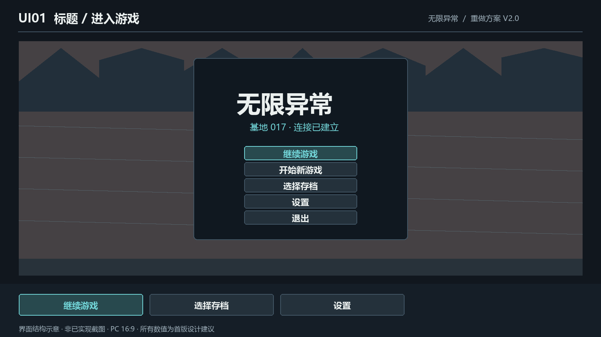

入口：启动新版程序后进入；第一次启动没有继续按钮。

操作与结果：继续：加载最近成功存档；新游戏：进入 UI02 选择空槽；设置进入 UI03。

状态与边界：没有存档显示“开始新游戏”；损坏档转 UI33，不能悄悄清档。

返回：退出游戏先等写盘完成。 验收：第一次启动、已有一档、损坏档三种入口正确。

### UI02 存档选择 / 新建基地

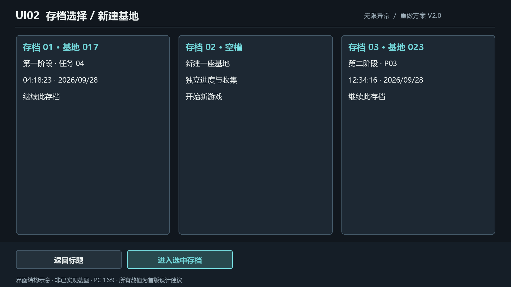

入口：UI01 的存档入口。

操作与结果：空槽点新建→输入基地代号→确认→UI04；已有槽点继续。删除需二次确认并显示档名。

状态与边界：槽满时先选档，禁止默认覆盖；删除确认要求输入“删除”。

返回：取消新建 / 删除返回本页；Esc 回 UI01。 验收：新建、复制备份、切槽不会串档；删除不影响其他槽。

### UI03 设置 / 画面声音与辅助

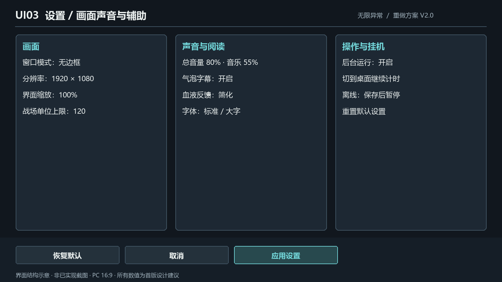

入口：UI01 或 UI32。

操作与结果：修改本页先预览，应用后保存；分辨率修改显示15秒恢复倒计时。

状态与边界：大字模式重排而非裁剪；简化血液关闭喷溅而保留命中闪光。

返回：从哪个界面打开就回哪里；取消恢复打开时设置。 验收：1280×720 与大字模式不遮挡主按钮；音量即时生效。

### UI04 开场 / 监控简报

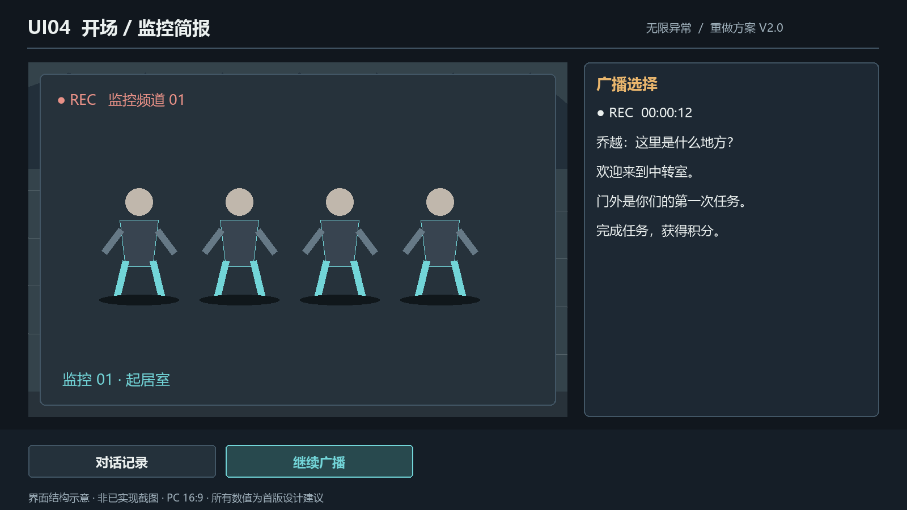

入口：新档进入，四人醒来；首次流程约90秒，可加速不可跳过玩法指引。

操作与结果：点击广播继续固定剧情；最后镜头退到 UI05 并高亮任务门。

状态与边界：此时只用“连接已建立”等中性字眼，不能在用户界面提前写“你是房间”或“模拟训练”。

返回：新档序章不返回标题外的管理页；Esc 可暂停 / 存档。 验收：广播主体不出现人的头像；四个角色站位与后续档案一致。

## 逐界面制作：房间、出战与战斗结算

### UI05 基地总览 / 场景内整备

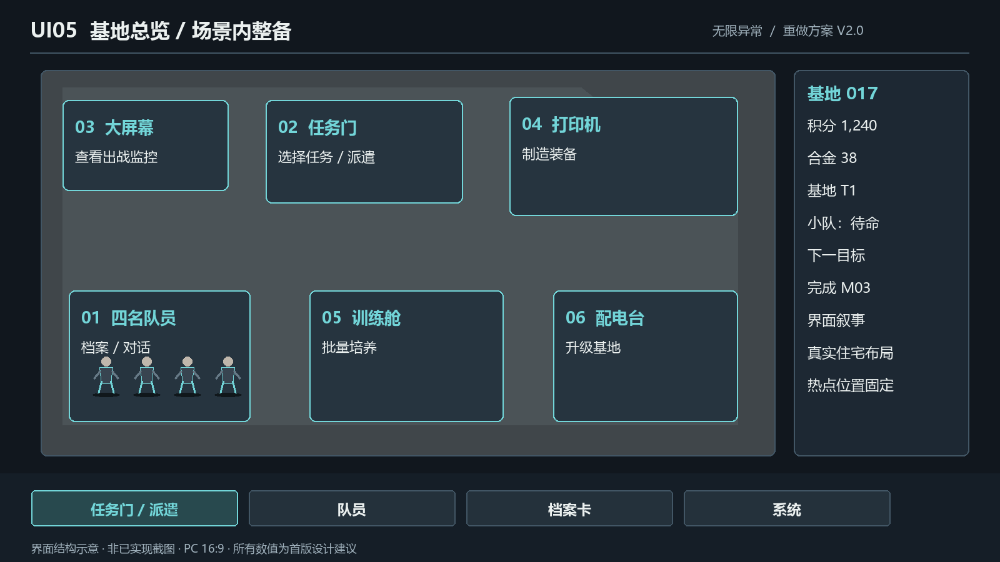

入口：UI04 结束、任务返回、召回或训练失败之后。

操作与结果：点击打印机→UI18；训练舱→UI17；配电台→UI19；人→UI14/21；大屏幕→UI09；门→UI06。

状态与边界：出战时队员位置显示“出战中”，升级入口可查看但确认禁用，并显示“召回小队后可升级”。

返回：这里是一阶段主界面；Esc→UI32。 验收：所有热点有名称、亮边和键盘焦点；升级设施后该设施模型发生变化。

### UI06 任务地图 / 地球十区

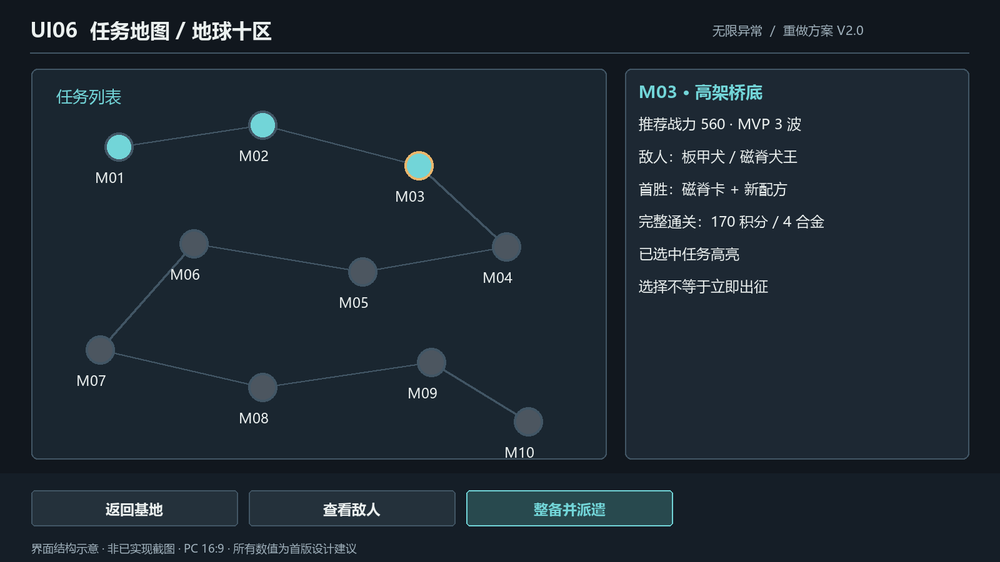

入口：UI05 点门。

操作与结果：选一个任务，右侧展示敌人、奖励、已胜次数；派遣→UI07；未解锁任务仍可预览剪影。

状态与边界：前一任务首次完整胜利解锁下一任务；训练未完成时按钮指明需等待哪个队员。

返回：Esc / 返回→UI05；记住上次选中任务。 验收：不以战力硬锁；不足只给风险提示，玩家仍可尝试。

### UI07 出发确认 / 小队与自动规则

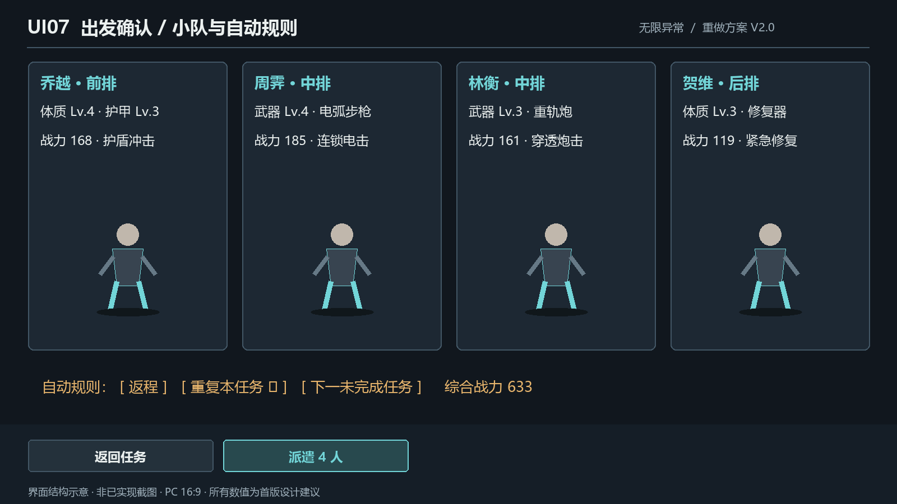

入口：UI06 选中已解锁任务。

操作与结果：查看四人和装备；自动规则选“返程 / 重复本任务 / 下一未完成任务”。确认→UI08→UI09。

状态与边界：默认四人齐出；正在训练提示结束剩余时间，可取消训练返还未消耗费用。新任务默认关闭自动下一关。

返回：取消→UI06；点击队员→UI14，返回保留任务选择。 验收：派遣操作原子锁定整队及所有一阶段成长，不能重复扣费或重复出发。

### UI08 任务门 / 加载与传送

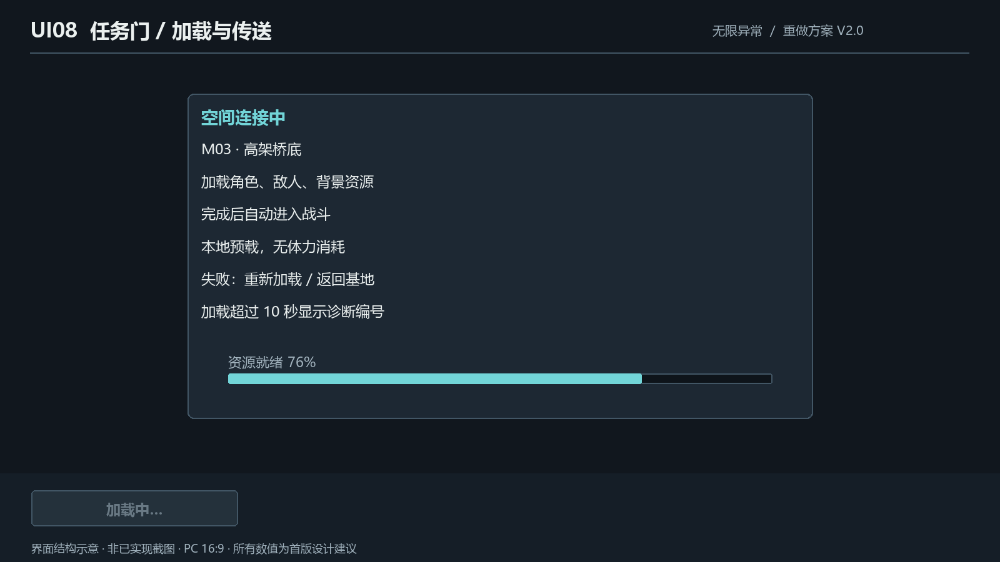

入口：派遣、主动切换训练任务或进入新星球时。

操作与结果：加载成功后进入目标战斗；任务配置和资源均成功才提交运行状态。

状态与边界：缺资源显示可重试；失败不扣资源、不将角色留在出战状态。

返回：失败时可回上一个安全界面；正常传送不重复点确认。 验收：连续点击派遣只创建一个战斗实例；错误重试不重复发奖励。

### UI09 第一阶段 / 自动战斗

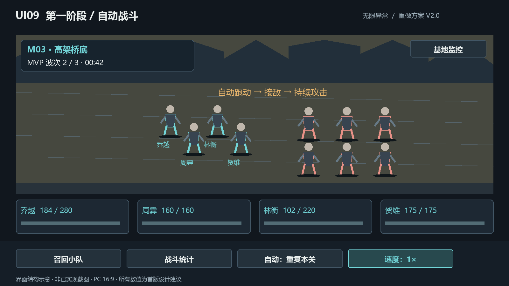

入口：UI08 加载成功，或 UI05 点击出战监控。

操作与结果：无需点技能，四人自动寻敌与攻击；速度在1×/2×切换；统计→UI10；召回→UI13。

状态与边界：倒下的人本次任务不再参战；幸存者每波回血。出战中所有一阶段升级锁定；可回基地查看。正式版波数和结束条件读取任务配置，不固定三波。

返回：左上“基地监控”回 UI05但战斗继续；Esc→UI32。 验收：无受击硬直；波间回血不复活倒地者；自动下一关遇失败必停。

### UI10 战斗统计 / 只读覆盖层

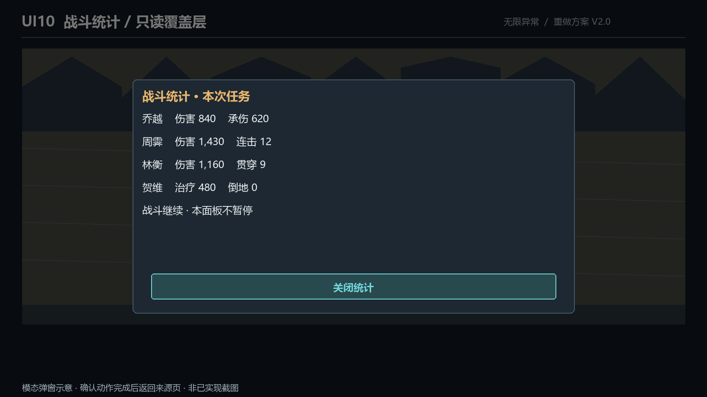

入口：UI09 或 UI23 点击统计。

操作与结果：可切伤害、承伤、治疗；点人物展示来源，不提供装备更换。

状态与边界：战斗结束时弹层自动关闭并展示结算；数据保留在本次报告。

返回：关闭 / Esc 回原战斗，不重置速度。 验收：面板记录采用同一战斗事件，不与实际结算数字分离。

### UI11 任务胜利 / 奖励与继续

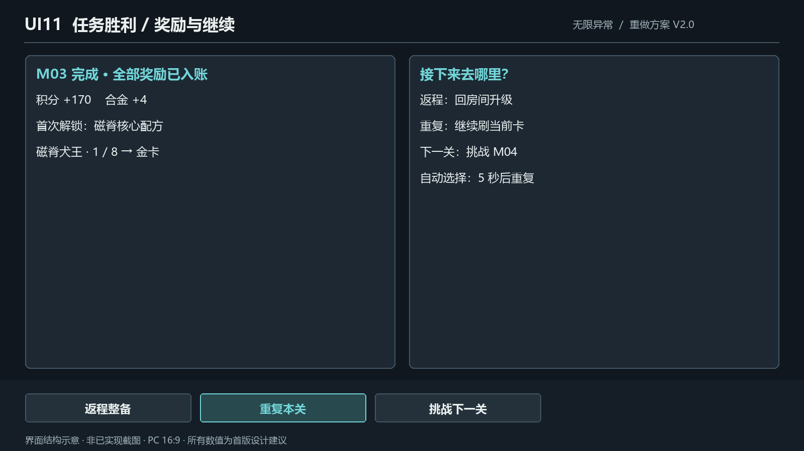

入口：当前任务配置的全部战斗目标完成；MVP为三波全胜。

操作与结果：奖励在此页出现前按唯一 run_id 入账；倒下成员在返回训练间隙恢复；重复从本任务配置的第一波重新开始。

状态与边界：自动选择倒计时5秒，任意手动操作取消；最后一关下一关按钮显示“已到最后任务”。

返回：返程→UI05；重复/下一关→UI08。 验收：关闭程序再进入不会再次领本次奖励；卡进度只加一次。

### UI12 全队倒下 / 训练返回

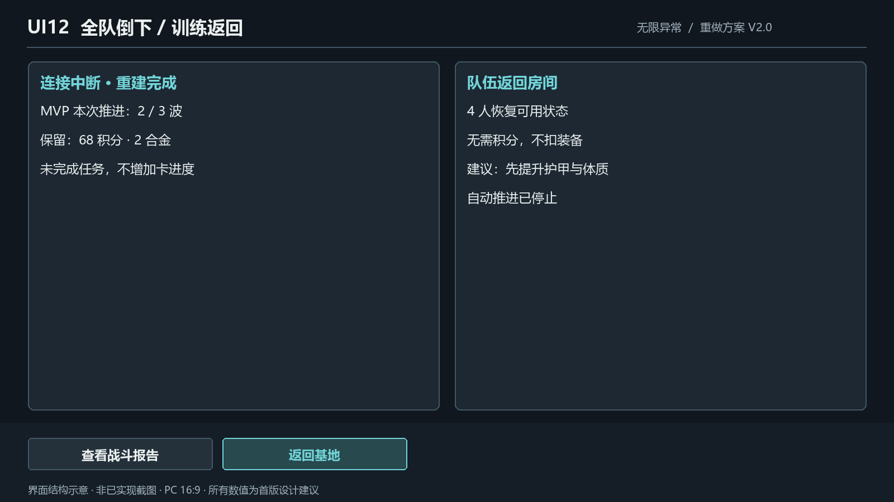

入口：第一阶段四名队员全部倒下。

操作与结果：结算已完成波次奖励；免费恢复四人，自动回房间。表层文案说“重建”，揭示后改“训练复位”。

状态与边界：不会因没钱陷入不能复活的循环；失败不自动连续挑战同一失败关。

返回：报告→UI10 的静态版本；返回→UI05。 验收：失败、强退恢复和自动模式均不丢队员及装备。

### UI13 召回确认 / 明示保留与放弃

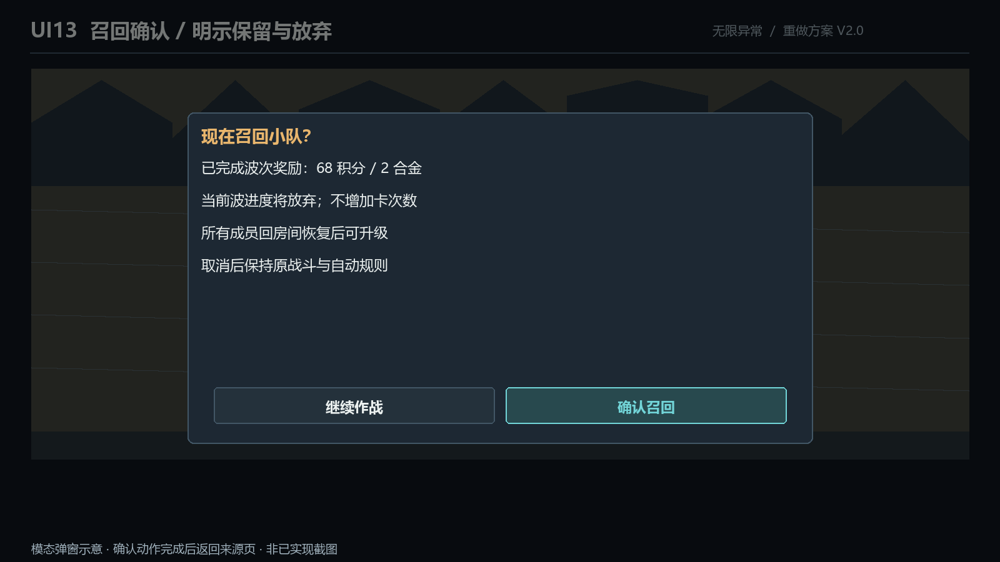

入口：UI09 的召回或出战中从升级页点击召回。

操作与结果：确认后停止自动规则，结算完成波次，恢复队员；跳回发起召回的升级页。

状态与边界：弹层显示期间一阶段战斗暂停，避免确认期间损失；点取消后恢复。

返回：Esc / 取消回原界面；确认→UI05或原成长页。 验收：显示的已获奖励与结算一致；召回按钮防重入。

## 逐界面制作：队员、设施与训练档案

### UI14 队员档案 / 体质成长

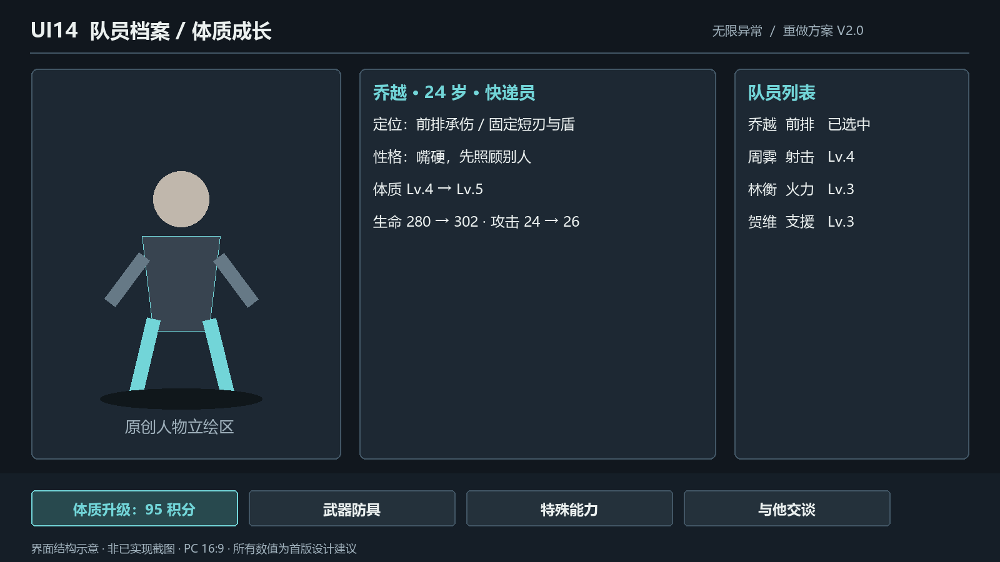

入口：UI05 点人 / 队员，UI07 点头像。

操作与结果：左侧人物全身，中央属性增量，右侧列表；体质升级即时生效；武器→UI15，能力→UI16，对话→UI21。

状态与边界：出战时升级禁用且显示召回入口；上限显示“基地升至 T2 可继续”。

返回：关闭→来源页面，记住选中角色。 验收：升级前后差值、消耗和战力同时可见；禁止长按自动超额购买。

### UI15 装备 / 对比与更换

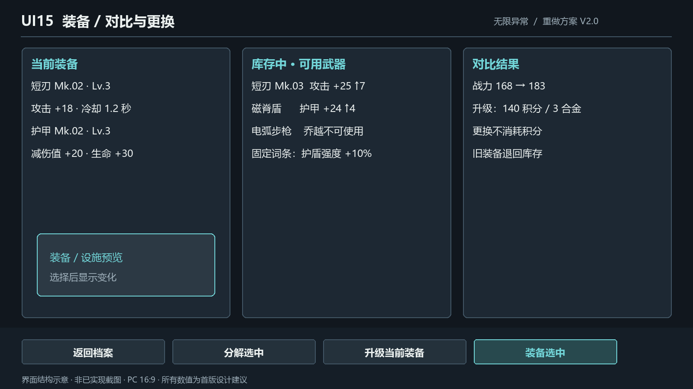

入口：UI14 武器防具页签，或 UI18 制造完成后。

操作与结果：选库存物品→右侧显示绿增红减→更换；分解→UI35。仅一件武器、一件防具，每种最多一条特殊词条。

状态与边界：不同职业武器灰显原因；已装备物不允许分解，先卸下；出战不能换装。

返回：返回 UI14 同一角色。 验收：装备更换后物品总数守恒；固定唯一物品不生成随机词条套娃。

### UI16 特殊能力 / 可见升级效果

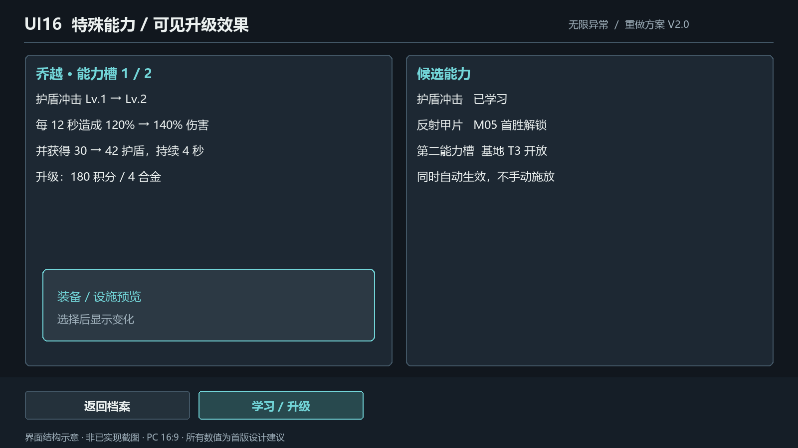

入口：UI14 特殊能力页签。

操作与结果：左侧显示效果及数值前后，右侧列表；选择已解锁能力后学习。首槽默认职业能力，第二槽选一个怪物模块。

状态与边界：配方未解锁给出具体任务；资源不足列缺多少；出战只读。

返回：返回 UI14；无购买确认弹窗，点击完成有属性动画。 验收：同源护盾取较强值不无限叠加；能力自动施放能在战斗看到对应表现。

### UI17 训练舱 / 一键均衡培养

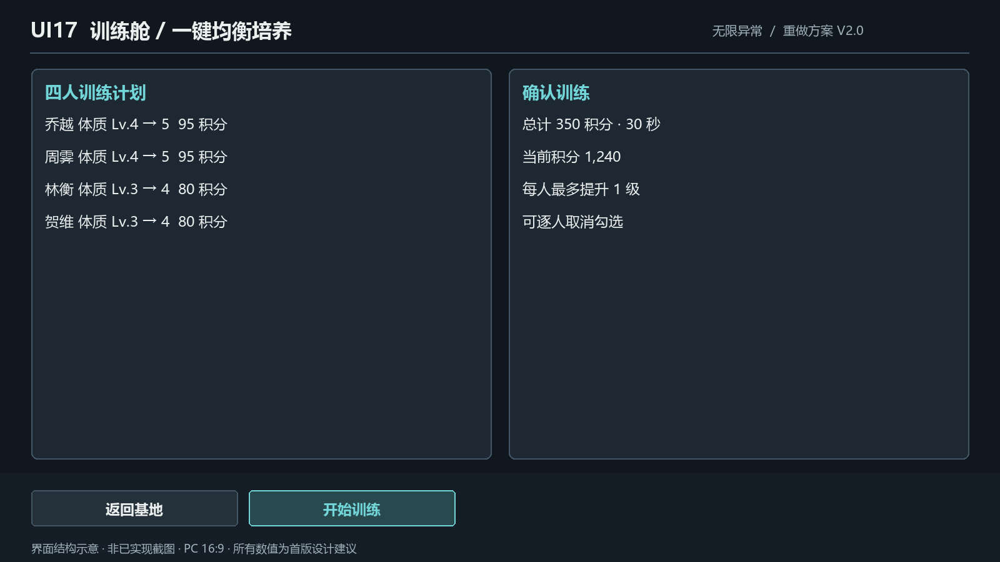

入口：UI05 点击训练舱。

操作与结果：批量预览每人下一体质等级，确认后进入30秒训练；单人在UI14可立即升级，同价格，训练批量提供便捷。

状态与边界：训练中不能派遣；取消训练返还全部预扣资源、不提升等级；训练结束一次性提交。

返回：训练开始后可关闭回基地，舱上显示剩余时间。 验收：批量升级和手动升级不得同时作用同一人；足额检查以确认瞬间为准。

### UI18 打印机 / 固定装备制造

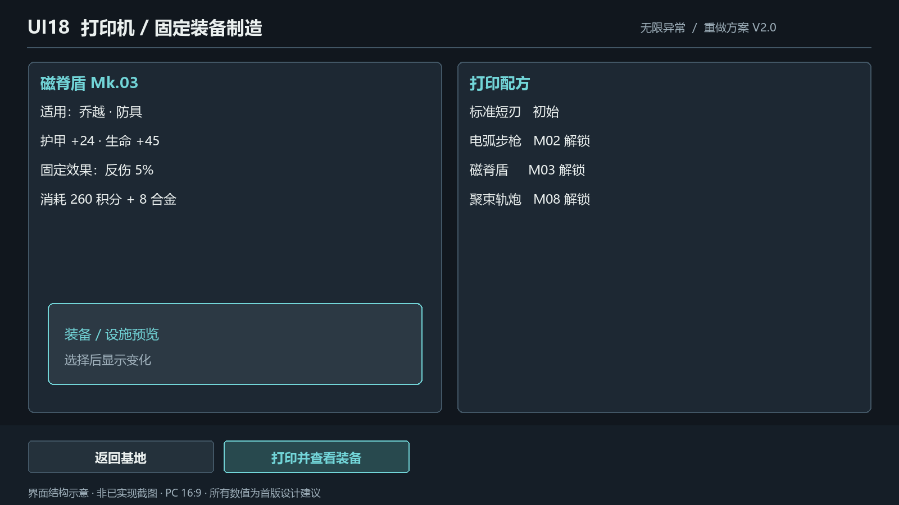

入口：UI05 点击打印机。

操作与结果：选配方→显示固定成品→确认即时制造并播放1秒打印表现→可跳UI15；同配方重复制造允许但提示已拥有。

状态与边界：设施等级不够显示“打印台 T2 / M03”；出战期间仅预览。

返回：关闭回UI05；配方选择保留。 验收：不抽卡，不用隐藏成功率；制造成品与预览一致。

### UI19 基地设施 / 升级可视变化

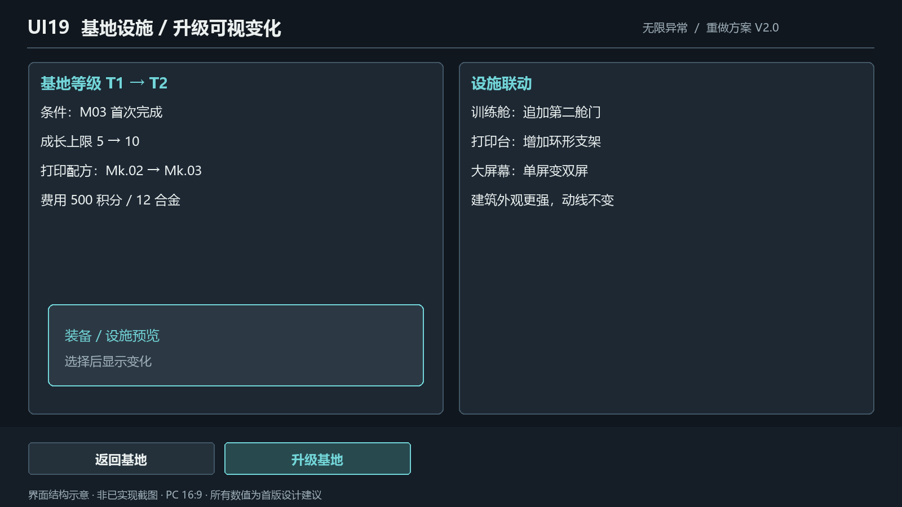

入口：UI05 配电台。

操作与结果：单一基地等级统筹设施上限，避免多个相同升级货币门槛；升级后回基地显示变化。

状态与边界：T2需M03；T3需M06；T4需M10；未到关卡条件时给具体原因。

返回：关闭→UI05；可点条件跳 UI06 对应任务。 验收：到达成长上限时升级按钮说明解锁方法，不能出现无解释灰按钮。

### UI20 异常档案 / 普通金钻收集

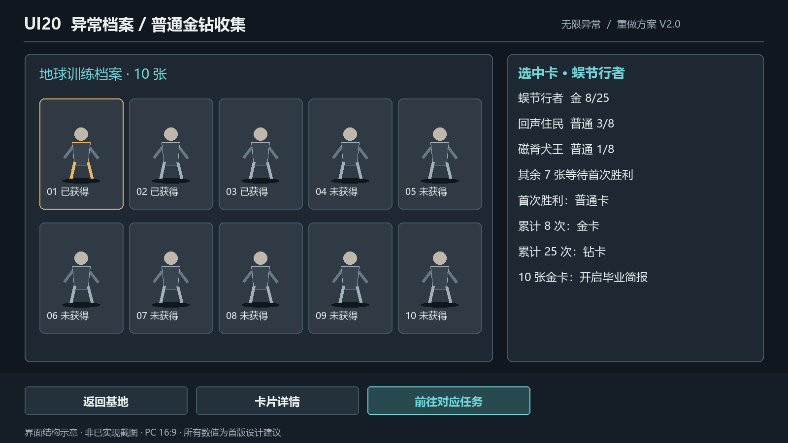

入口：UI05档案。

操作与结果：网格显示十张卡；点卡→UI36；目标按钮跳指定任务。顶栏展示金卡总数与毕业条件。

状态与边界：未获得显示剪影和关卡名；进度按胜利次数；钻卡是收集目标，不拦截主线结局。

返回：返回→UI05。 验收：每次任务最多累计一次；读档、自动重复、召回不产生虚假卡次数。

### UI21 人物对话 / 广播与档案

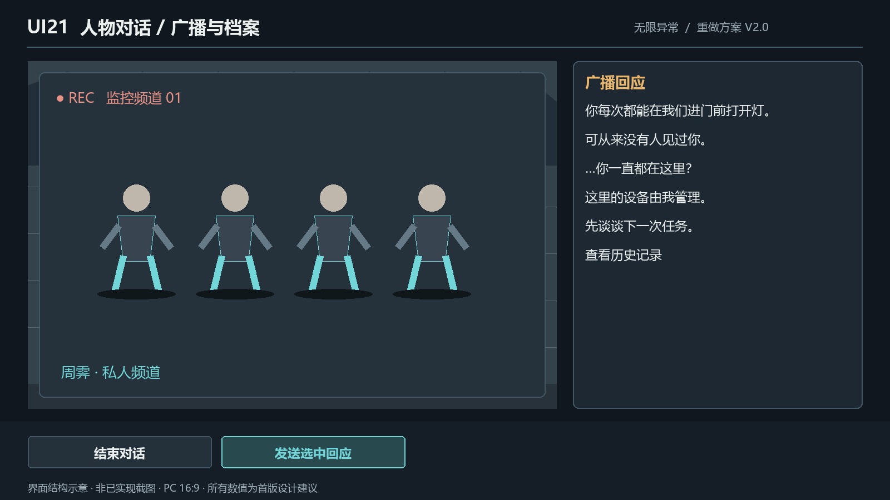

入口：UI05点击人物或UI14交谈；任务里也可出现不阻挡的气泡。

操作与结果：固定对话节点，两种回应影响下一句语气及记录，不给隐藏好感数值、不改变主线难度。

状态与边界：每位角色3个主对话节点：M01后、M05后、揭示前；出战时档案可读但不进行基地面对面对话。

返回：关闭返回发起页面。 验收：已读对话可重看；不因跳过文字错过装备或必需进度。

## 逐界面制作：真相与星际战争

### UI22 毕业简报 / 房间身份揭示

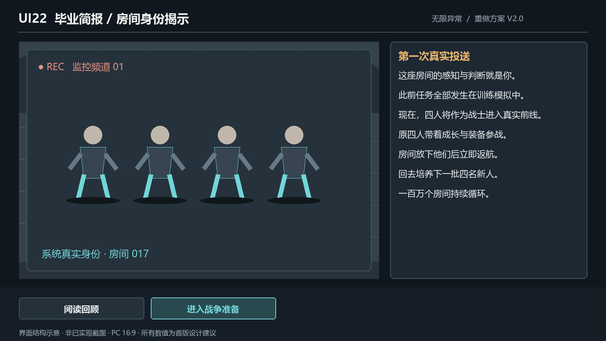

入口：M01—M10全部达到金卡后，UI05大屏幕出现毕业简报，玩家主动打开。

操作与结果：完整揭示训练谎言及玩家本体；UI38确认转阶段后进入UI23，首次先弹UI24选择P01。

状态与边界：没有全金假结局、全钻真结局；此处是中场转折。禁止自动切阶段打断玩家整备。

返回：阅读时可退出回UI05；确认转阶段后进入基地网络，原房间继续培养与运输。 验收：原四人的身份、成长、装备与生命状态正确迁移为真实战士；他们也会永久阵亡；不能重复投送同一队。

### UI23 第二阶段 / 战争与底部经营

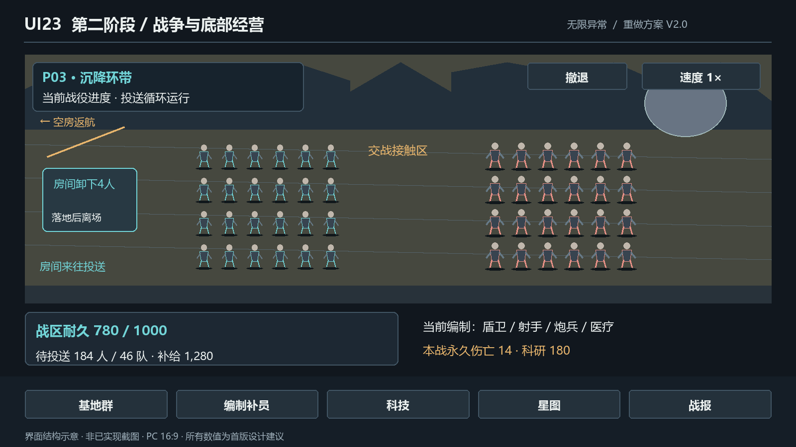

入口：转阶段后与后续战争运行时的常驻主界面。

操作与结果：上方显示房间到达、放下四人、空房离场与地面作战；下方打开培养/运输经营抽屉。房间离开不带走已部署士兵，也不等待他们阵亡；撤退另走UI37。

状态与边界：战争中可升级培养与运输科技；每个房间经历培养、满载去程、四人下车、空载返程。战士沿用完成培养时的属性，已部署者不因空房返航消失。

返回：Esc暂停；关闭抽屉回战场；主动撤退 UI37。 验收：每次房间到达恰好交付4个独立战士；每个投送编号只处理一次；原四人与后续新人使用相同永久伤亡规则。

### UI24 星图 / 挑战与退守

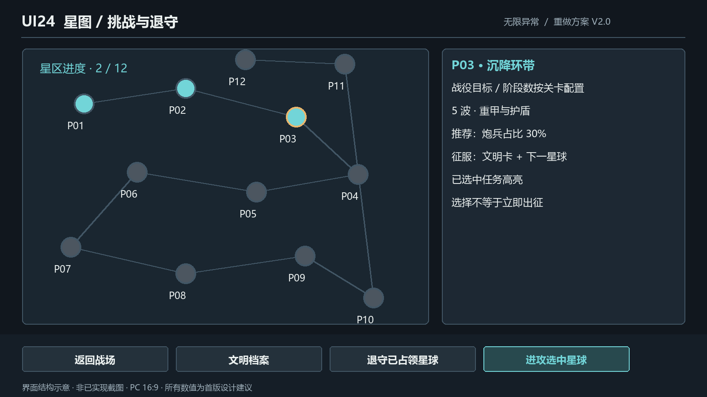

入口：UI23 星图。

操作与结果：选已解锁星球显示环境和兵种提示；未处于战斗时可直接进攻，正在战斗需先UI37撤退确认。

状态与边界：下一星球需当前征服一次；战败退回上一星球驻防。P01战败回轨道安全区。

返回：关闭回UI23；选中星球不自动改变当前战场。 验收：不把“选中”误当“出征”；已占领星球能稳定产出补给和科研。

### UI25 基地群 / 房间培养与往返运输

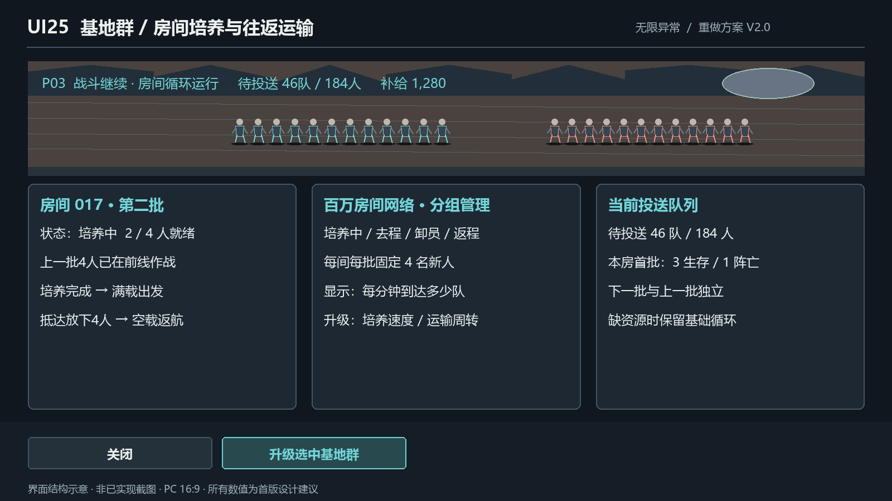

入口：UI23底部基地群抽屉，高度占屏55%，背景战争保留可见。

操作与结果：按群组查看房间在培养、满载去程、卸员、空载返程中的数量；单房详情显示当前四人批次与历史投送记录。升级缩短培养或运输时间，每次容量仍为4人。

状态与边界：每间房同时只有一个培养/运输批次；四人培养齐全才能出发。投送后房间独立返航，不等前线死完，不把阵亡者复制为下一批。

返回：关闭回UI23；进入星图只切换抽屉。 验收：培养计时不能跳过去程和返程直接增加前线人数；百万房间用分组汇总表达；资源耗尽仍有基础培养运输渠道。

### UI26 培养编制 / 每房四人批次

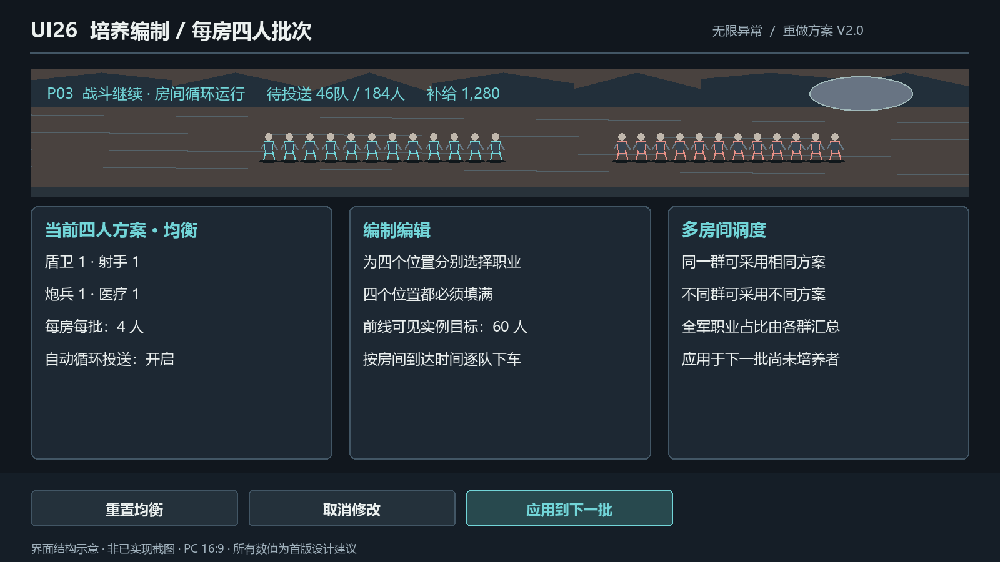

入口：UI23 编制补员。

操作与结果：给四个位置分配职业，合计必须为4人；可将一个方案应用到选中房间群。全军百分比只作汇总，不把每房交付改为10人。

状态与边界：更改方案只影响尚未开始的培养批次；在培、在途和前线士兵不换身份、不复活。抵达的完整4人队可进入前线队列，不能重复计数。

返回：取消恢复原比例；关闭回UI23。 验收：每个房间批次恰为4人；四人可有重复职业；全军占比由实际队伍合成；修改方案不复制士兵。

### UI27 战争科技 / 清晰成长路线

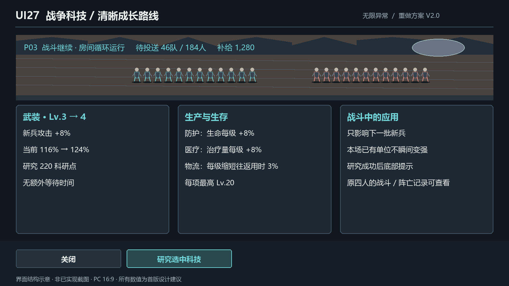

入口：UI23 科技抽屉。

操作与结果：武装、防护、医疗、物流四条线固定成本递增；前三项只应用于下一批开始培养的新兵，物流从下一趟出发开始生效。

状态与边界：缺科研写出缺口和稳定产出地点；满级后按钮显示已完成。

返回：关闭回UI23。 验收：升级与兵员生成按事务顺序执行；不追溯改变已上场单位血量。

### UI28 战争报告 / 伤亡与收益

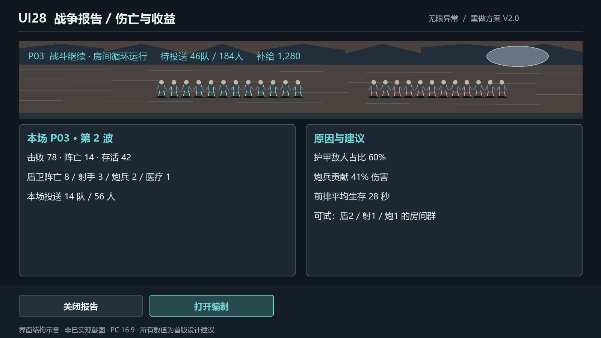

入口：UI23战报或结算查看详情。

操作与结果：显示本场和累计两个页签；建议由公开阈值触发而非假装智能分析。

状态与边界：永久伤亡显示姓名/批次及文本，原四人与其他战士一视同仁；房间培养下一批不会修改先前死者状态。

返回：关闭回原战场或UI30结算。 验收：损失分项之和等于总数；胜利或撤退记录均可重看最近20场。

### UI29 文明档案 / 征服记录

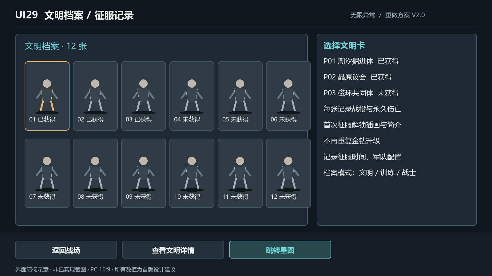

入口：UI24文明档案入口或UI30首次征服后。

操作与结果：网格与UI20同布局，详情复用UI36文明模式；训练模式为历史模拟记录；战士页复用UI14只读布局，标明在培、在途、前线、生还或阵亡，不复活人物。

状态与边界：未征服显示信号轮廓；不继承训练卡的金钻刷取门槛；查看档案不暂停，开始历史训练才暂停战争。

返回：关闭回UI23或原星图；历史模式的返回恢复战争快照，不转回一阶段主线。 验收：训练卡和文明卡分开存储、不混淆获得条件。

### UI30 星球战役结算 / 胜利与战败

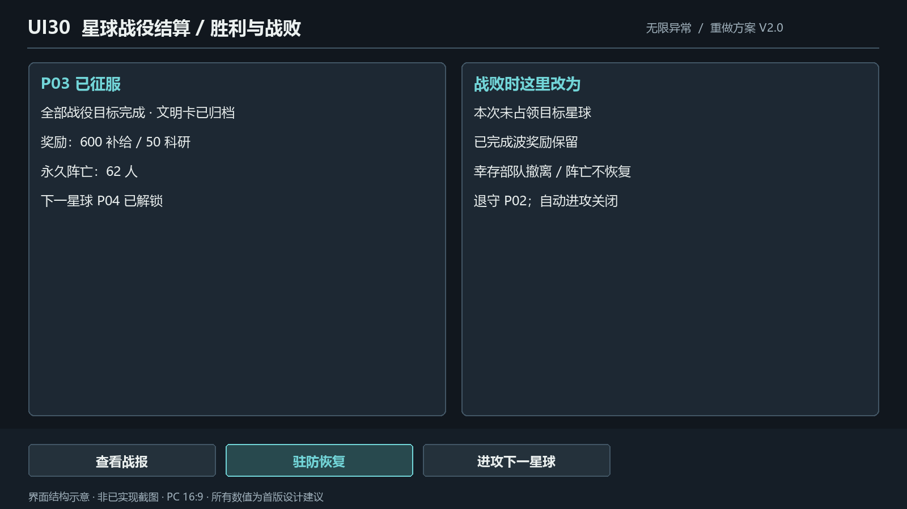

入口：关卡配置的战役目标全部完成或战区耐久耗尽时触发；不能将第5波硬编码为正式版终点。

操作与结果：胜利可驻防或下一星球；默认驻防等待用户，除非事先打开自动推进；失败自动退守上一已占领星球。

状态与边界：初始轨道区无敌人、能免费产兵。无法回退到不存在的P00关卡。

返回：驻防/退守→UI23；下一关→UI08；首次卡→UI36。 验收：结算前原子记账；战败不扣已占领星球进度。

### UI31 最终结局 / 人类占领全域

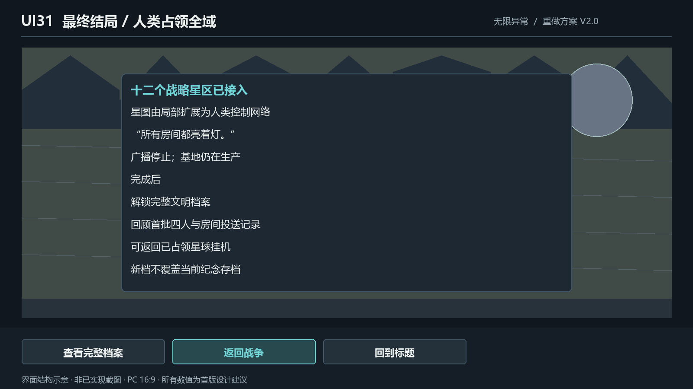

入口：P12首次征服，结算后玩家主动点最终简报。

操作与结果：播放90秒结局，表现12个节点代表全部战略文明网络被控制；结尾可继续收集训练钻卡的历史训练模式。

状态与边界：历史训练是档案里的模拟回放，保留阶段一成长数据；不会逆转战争进度。历史模拟中的影像不改变真实战士的存亡状态。

返回：继续→UI23；标题→UI01；再看结局从档案进入。 验收：只有一个主线终局，不用全钻再解锁真正结局。

## 逐界面制作：系统恢复与关键确认

### UI32 暂停 / 保存并退出

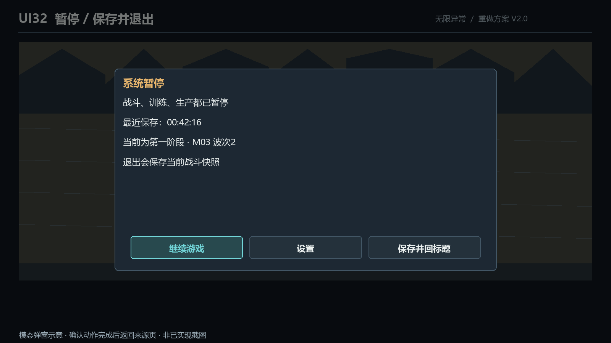

入口：任何非加载界面Esc；对话可打开系统菜单。

操作与结果：打开后全局模拟暂停；设置回UI03；保存成功才退标题。系统提示不自动暂停，只有此菜单和明确确认框暂停。

状态与边界：写盘失败留在菜单，显示重试和备份路径；禁止假成功退出。

返回：继续回原界面；Esc等同继续。 验收：声音、动画、实际战斗时钟一起暂停；多层弹窗只关闭最上层。

### UI33 存档恢复 / 兼容性错误

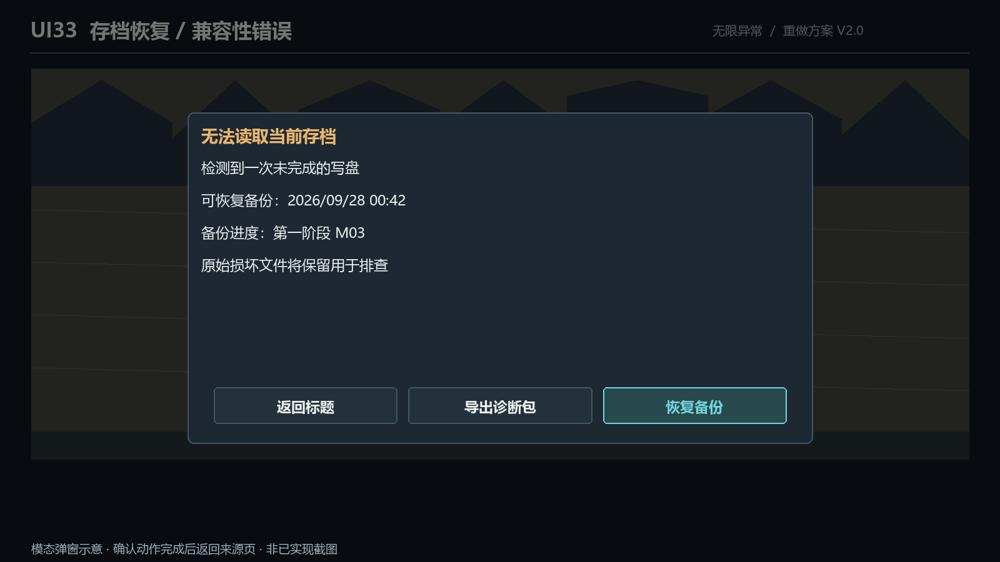

入口：读档失败、版本高于程序支持，或上次保存中断。

操作与结果：可恢复最近校验成功备份；版本过新只提示升级程序和返回，不能降级覆盖。

状态与边界：恢复失败仍保留原档；诊断包只含游戏日志、配置版本与存档，不含系统凭据。

返回：返回UI01；恢复成功回UI02选择该档。 验收：损坏主档能恢复备份；历史旧版无限异常存档绝不默认读入新版。

### UI34 通用状态 / 空、锁定、失败、成功

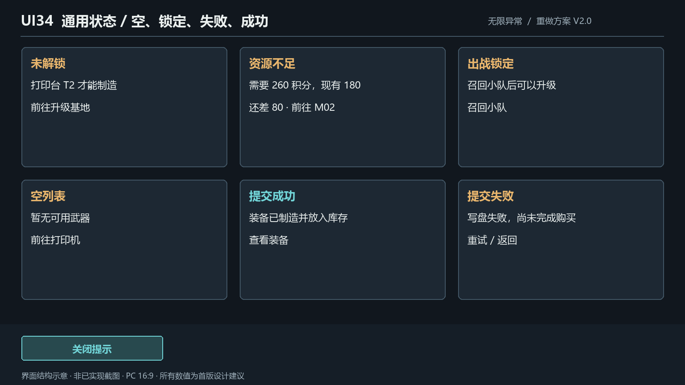

入口：所有系统复用本图中的六种反馈样式。

操作与结果：行内解释优先；成功短提示2秒自动消失，不截断操作；资金不足不弹全屏窗口。

状态与边界：重要损失、删除、转阶段才二次确认；保存失败常驻直到处理。

返回：提示中的前往按钮记录返回来源。 验收：每个禁用按钮附近均能读到原因；不只靠颜色区分成功与失败。

### UI35 装备分解 / 防误删确认

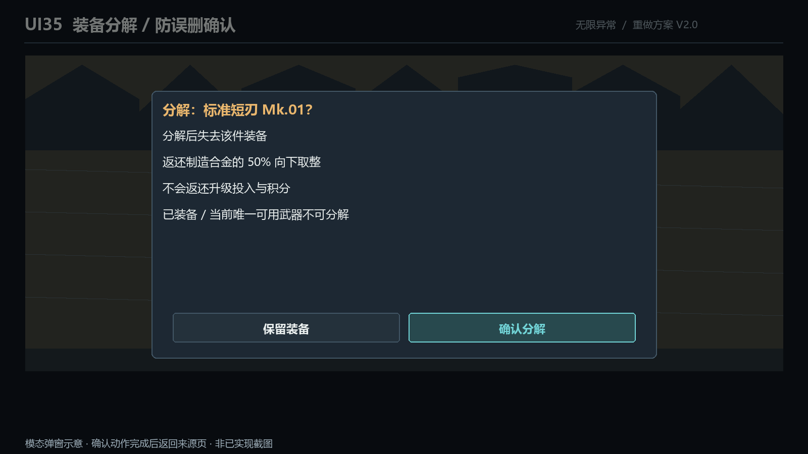

入口：UI15选中库存装备点分解。

操作与结果：展示精确返还值，确认一次事务销毁物品并加合金；本次例品返还2合金。

状态与边界：禁止分解职业最后一件可用武器；避免四人无法出发。

返回：确认或取消均回UI15并刷新库存。 验收：操作失败全回滚；分解不会出现负库存或重复返还。

### UI36 卡片详情 / 图鉴大图

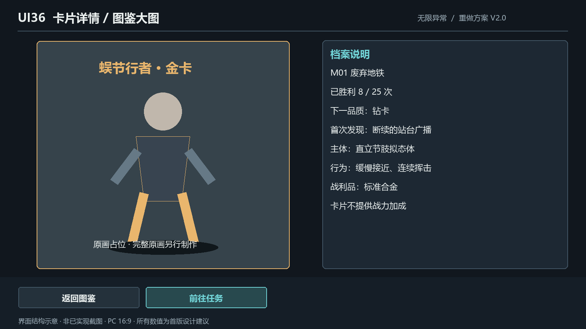

入口：UI20 / UI29点卡。

操作与结果：左侧大幅精细原画占55%，右侧名称、来源、进度和短背景；文明模式显示征服日期、总阵亡、战役配置。

状态与边界：未获得保持完整轮廓剪影不展示剧情；获得后可放大原画，Esc收起。

返回：回UI20或UI29，保持滚动位置。 验收：普通金钻只换边框光效和背景细节，不遮挡卡画与说明。

### UI37 战争撤退 / 永久伤亡确认

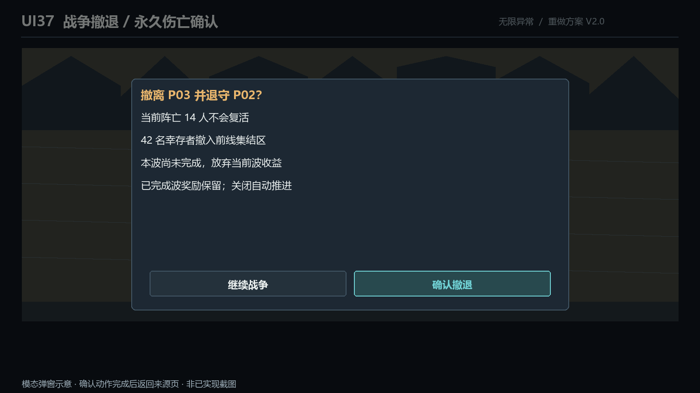

入口：UI23撤退入口或UI24战中切换星球。

操作与结果：撤退另行完成战场撤离，幸存战士保持身份、职业与剩余生命进入集结区，阵亡保持阵亡；空房自动返航和主动部队撤退是两个独立流程。

状态与边界：弹层暂停战斗和生产；取消恢复；阵亡永不转储备。

返回：确认→上一已占领星球驻防；P01→轨道安全区。 验收：空房返航不触发撤退；主动撤退不复制士兵；幸存者以原身份再部署，培养的新四人具有全新身份。

### UI38 转阶段确认 / 迁移预览

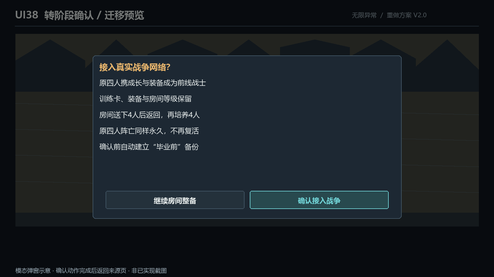

入口：UI22简报结束。

操作与结果：确认创建迁移快照和原四人首批投送记录，进入UI24 P01；这次明确解释真实死亡和房间的往返循环。

状态与边界：存档失败取消迁移；原四人只迁移一次，不额外复制出200名替代兵员；500补给仍是首版试算建议。

返回：取消→UI05；确认后可从档案打开历史训练回放，不回退主线状态。 验收：四人的身份、成长、装备迁移到真实战士；首批满载去程→落地卸下四人→空房返航→培养下一批完整可见。

## 制作人员怎么开工：工程与数据结构

本次文档是新版本设计，不修改现有发行包。新实现建议放在独立目录scenes/reboot、scripts/reboot、assets/reboot；验证完成前不改根启动脚本。旧containment/continuity/campaign工程、发行包和存档保留为历史，不自动导入新玩法。游戏引擎沿用本机已经安装的Godot，正式打包前固定经过项目验证的版本，不因这次文档自行升级工具链。

### 程序模块与场景树职责

| 模块 / 场景 | 负责什么 | 不得承担什么 |
|---|---|---|
| GameSession | 阶段、存档槽、当前运行状态、全局暂停和速度 | 不直接绘制任何战斗单位。 |
| BaseScene / WarScene | 房间热点或战争场景、UI入口、背景显示 | 不写死奖励与升级价格。 |
| BattleSim | 单位状态、技能计时、目标、伤害、波次和胜负；固定逻辑步长1/20秒 | 不依赖帧动画、屏幕分辨率和显示单位多少决定结果。 |
| BattlePresenter | 根据模拟状态播动画、移动精灵、弹道与数字，复用对象池 | 不发奖励、不修改经济库存。 |
| ProgressionService | 成长成本、上限、解锁、装备与模板合法性检查 | 不通过关闭UI绕过出战锁定。 |
| EconomyTransaction | 扣费、加物品、卡进度、run_id结算的单次提交 | 不在动画结束回调里二次发奖。 |
| RoomCycleService | 逐批处理培养、满载去程、卸员、空载返程；百万房间按群组统计与到达事件计算 | 不在培养完成瞬间直接刷前线兵；不等待原四人死亡才培养下一批；不在暂停时继续计时。 |
| SaveService | 主档/备份校验、写临时文件后替换、版本迁移、失败反馈 | 不触碰旧版存档，不在读取失败时自动新建覆盖。 |
| UIRouter | 屏幕栈、来源位置、弹层、返回、确认和输入焦点 | 不随意改变战斗规则和当前目标任务。 |

### 必须建立的数据表

| 表 | 最小字段 | 示例 / 校验 |
|---|---|---|
| CharacterDef | id,name,role,weapon_family,base_hp,base_atk,armor,interval,skill_id,portrait,anim_set | char_qiao / shield；同一ID只出现一次。 |
| MissionDef | id,prerequisite,waves,phase_goals,reward_weights,completion_rule,reward_points,reward_alloy,card_id,background | MVP可3波；正式读可变长列表与目标，不硬编码第3波结算。 |
| EnemyDef / WaveDef | 敌人基础属性/技能/体型；每波组成、批次时刻、出生范围 | 允许同族变体，禁止缺死亡动作。 |
| EquipmentDef | id,slot,role_limit,mk,fixed_stats,affix,recipe,level_curve | 一武器一防具，角色限制可读。 |
| AbilityDef | id,role_limit,unlock,levels,cooldown,effect,target_rule | 每级前后差值可以由UI自动计算。 |
| FacilityDef | tier,mission_gate,cost,level_cap,visual_variant | T1—T4外形与上限一一对应。 |
| PlanetDef | id,previous_planet,enemy_factor,waves,rewards,card,background | P01的失败目标为orbit，不引用P00。 |
| RoomCycleDef / TechDef | 每批人数=4、培养/去程/卸员/返程时长、群组方案、运力与费用；科技曲线 | state=training/outbound/unloading/returning；每批交付只提交一次，空房返程不可带回已部署战士。 |
| DialogueDef | node_id,trigger,speaker,text,options,next,read_flag | 不可因选择某一句错过必需解锁。 |
| UISpec | screen_id,entry,allowed_actions,back_target,locks,empty_state | 38界面与本文件screens.json一致。 |

### 存档格式与不可丢的字段

存档保留基础字段及训练数据；war新增原四人的真实unit_id与存亡状态、room_group_id、房间各循环状态数量、独立首房room_id、当前cohort_id、当前4人身份、到达队列、去/返程剩余时间、已交付cohort记录、在途/前线/集结区分职业人数、阵亡和战报。百万房间用群组状态桶和事件队列汇总，不保存一百万套动画对象。原四人保留可追溯记录；阵亡不可被重新培养或读档领取逻辑覆盖。任务保存可变长波进度与奖励权重，升级正式内容不依赖总波数为3。

提交顺序：验证当前状态与余额→构造内存事务→写临时存档并校验→原子替换主档并保留备份→显示成功。保存失败回滚内存事务并保持按钮可重试，不能一边说失败一边扣钱。转阶段保留毕业前快照；同一run_id与奖励编号具有幂等性。版本迁移仅支持明确测试过的前一个新版schema，旧游戏数据放在独立命名空间。

### 性能预算与可扩展性

首版详细表现实例目标120（我方60、敌方60），它只是渲染与局部战斗表现预算。用户明确的100万个房间网络通过分组模拟、四人投送批次和战区聚合表现；不得据此写成世界只有60名士兵。房间视觉至少显示满载到达、四人下车、空房离场三段；数据层持续跟踪未绘制的运输批次及各战区兵力，不因隐藏精灵取消战力或伤亡。该规模的聚合模拟需要先做压力与守恒验证。

暂定性能目标：1080p、120战斗单位时中端目标机稳定60fps；最低目标机保底30fps；首次进入任务≤5秒，后续预载切换≤2秒，内存预算≤2GB。上述均需选定具体测试机器验证，当前没有声称已达到。优先测满单位、满技能与2倍速叠加，不只测空场景。

## 资产清单与文件交付标准

| 类别 | 首版完整数量 | 交付格式 / 验收 |
|---|---|---|
| 角色设定 | 4人立绘+每人正侧背3视图+4职业兵种简化版 | 原始分层文件+透明PNG；一致身高比例和手持方向。 |
| 角色动作 | 4人×5基础动作=20组，约176帧起算 | PNG序列+图集+动画元数据；脚底锚点稳定、边缘无白圈。 |
| 敌人 | 训练8小怪家族+10首领；战争5家族+终局首领 | 每个至少待机/移动/攻击/死亡4组；共24种独立基础主体，变体另列。 |
| 场景 | 基地4级外观、训练10背景、星球12背景、轨道安全区1 | 每景3层可独立导出；遮挡区与可走地面说明。 |
| 卡牌 | 训练10+文明12=22原画；训练共用3档边框 | 原画建议1024×1536；标题与文字由UI绘制。 |
| 界面 | 38界面设计与组件库 | 面板、按钮、页签、资源、进度、确认框、提示、锁定、空状态。 |
| 效果 | 四武器弹道/命中，四职业技能，4怪物模块，传送/打印/升级 | 效果颜色与实际伤害范围一致；简单模式可关闭装饰粒子。 |
| 声音 | 阶段音乐各2首+结局1首；4武器与主要交互音 | 循环无断缝；按音乐、环境、效果3总线分类，字幕文本独立。 |
| 剧情 | 8个主剧情场次+4人各3节点+22卡文案 | 表格/JSON，触发条件与已读标记；不只交一篇散文。 |

命名建议：char_qiao_run_r_001.png、enemy_centipede_attack_001.png、bg_m01_mid.png、card_m01.png。每个动画附pivot、fps、loop、hit_frame与原图尺寸；所有清单记录负责人、状态、最后版本、来源/授权情况。图像生成所得风格图仅作方向，未完成分层、动作一致性和导出验收前不能标为可直接投产资产。

## 按什么顺序做：阶段、交付和退出标准

建议以一名主程序、一名美术/动画整合、一名兼任数值剧情与测试的主创为基础规划；如果由个人兼任，里程碑顺序不变、历时按实际产能调整。下面是粗排范围，无法在没有动画小样和制作速度实测前当成保证工期。每一阶段必须先满足退出标准再扩大内容。

| 里程碑 | 范围 / 顺序 | 必须可演示的交付 | 退出标准 |
|---|---|---|---|
| A 体验与动作验证，3—5工作日 | 1角色+1怪物；1基地热点；最简自动战斗 | 跑动、攻击、无硬直、倒地、透明边缘与2倍速 | 120实例压力样例可跑；角色不漂移，攻击可辨。 |
| B 第一条完整链，5—8日 | UI01—15必要子集，M01，存档 | 新档→出战→奖励→升级→再战→退出重进 | 奖励只领一次；首次升级让下一次战斗明确变快。 |
| C 第一阶段可玩，8—12日 | 十任务、四角色、设施、卡、对话、全部前期UI | 十金毕业条件达成，训练失败与召回稳定 | 经济不存在卡死；无缺失入口；完整3次通关记录。 |
| D 战争纵向切片，6—10日 | 揭示与迁移、P01—P03、产兵、编制、科技、退守 | 从房间过渡到真实伤亡，并能失败后恢复 | 兵员守恒；无人/没钱都能恢复；主线存档可迁移。 |
| E 完整内容，10—15日 | P04—P12、22卡、全部背景、终局、UI38页齐全 | 从开始到人类征服的完整正式路径 | 无剧情占位文字，无错误参考素材，所有解锁闭环。 |
| F 调优与发布，5—8日 | 全程数值/性能/存档/分辨率与安装包验收 | 可分发安装包、版本号、更新说明、已知问题清单 | 目标机验收通过；旧版不覆盖；新包离开开发目录仍可运行。 |

这里把“MVP十任务”落在里程碑C；但仅有C不能证明后半段成立，必须继续D验证第二阶段，之后才批量补齐战争内容。整体粗估37—58个工作日是上述小团队并行基础上的规划范围；美术动画生产很可能是关键路径，A阶段测出单动作真实成本后重估，不能将AI生成速度直接当作可用资产交付速度。

## 测试与验收清单：什么叫做完

| 验收编号 | 操作 | 必须出现的结果 |
|---|---|---|
| T01 新档 | 无档启动→新建→完成序章 | 四人齐全，150积分/8合金，一套初始装备，不提前泄露训练真相。 |
| T02 出战锁 | 派遣后打开所有成长页 | 可看不可改，每处显示召回原因和去向。 |
| T03 无硬直 | 高频敌人连续击中近战 | 攻击节奏不被重置或永久压制，死亡除外。 |
| T04 波间 | 1名队员倒下后完成本波 | 存活3人满血，倒下者不归队。 |
| T05 回收 | 打完1波后召回与全灭各一次 | 保留20%任务奖励，卡进度不加，4人免费回基地。 |
| T06 自动 | 设置重复/下一关，制造一次失败 | 重复不跳关；下一关按序；失败停；手动操作取消结算倒计时。 |
| T07 幂等 | 领取瞬间强退重启多次 | 金币、合金、首胜与卡次数各只加一次。 |
| T08 上限 | T1练到5级后继续点升级 | 说明需T2；M03解锁T2；不能通过批量训练绕过上限。 |
| T09 装备 | 换装、分解、提交失败回滚 | 角色限制正确；唯一武器不被删；资金物品守恒。 |
| T10 卡与毕业 | 第7→8、24→25胜；十金后继续刷 | 品质准确；毕业可主动开始；无强制二次刷钻才能结局。 |
| T11 转阶段 | UI38确认时模拟写盘失败，再重试 | 失败仍在一阶段；原四人同ID、同成长只迁移并投送一次；不出现教官替代和额外200人；旧快照保留。 |
| T12 永久伤亡 | 原四人阵亡1人；原房间完成下一轮培养与投送 | 前线原队余3人，后续新增4个不同ID；死者仍死；原房间不因旧队存活而停止循环。 |
| T13 产能恢复 | 补给0、储备0、前线0，P01失败 | 回轨道区，免费基础产能恢复，可再战。 |
| T14 编制与运输 | 同一房间走完培养、去程、卸下4人、空载返程；中途保存重启 | 每轮只交付4人；卸员后空房走，士兵留下；重复到达事件不重复加兵。 |
| T15 战时科技 | 存活士兵时升防护，再出新兵 | 旧兵血量不变，新兵有新参数，UI说明一致。 |
| T16 暂停和速度 | 战斗、训练、生产各开暂停和2倍速 | 暂停都停止；2倍都统一；后台设置尊重用户选择。 |
| T17 历史回放 | 战争中打开历史训练再返回 | 战争暂停，训练卡可增长；战争伤亡和奖励不被重置。 |
| T18 正式波次与界面 | 测试可变长度任务配置，并逐一走通38页 | 超过第3波不提前结算；全部目标完成才领卡；UI显示配置总数；培养和运输进度分开。 |
| T19 显示 | 1280×720、1080p、大字、长名称 | 不裁剪主按钮和数字；重要数值不藏在悬停提示。 |
| T20 最终发布 | 新电脑目录运行、旧档在场、新档损坏 | 资源完整；旧存档不动；备份恢复可用；通关结局正常。 |

体验测试另外记录：首次升级前后任务用时、第一次主动召回发生点、每次失败到再次挑战所需时间、金币/合金余额、每类兵种伤亡、玩家能否说出自己当前目标。试玩时至少3名没看过设计稿的人各完成第一任务、第一次金卡和P01；若他们不知道下一步，先改信息层级和反馈，不先加新系统。

## 制作风险与本次建议的边界

| 风险 | 本版处理 | 何时必须重新评估 |
|---|---|---|
| 序列帧质量和成本 | 先做A小样；不预承诺一键生成全动作。 | 角色武器变形或每组动作修复超过人工制作成本。 |
| 刷金卡重复感 | 8胜作为起始值；新关、新配方、角色对白穿插；钻卡可选。 | 两次试玩连续反馈“只是在等毕业”，下调金卡次数或提前解锁新任务。 |
| 永久伤亡造成卡死 | 免费基础产能、安全驻防、旧星球稳定收益。 | 恢复再挑战超过5分钟无操作等待，则提高恢复产能。 |
| 后半段只是前半段放大 | 生产、编制、科技和永久损耗同时成立，战时可经营。 | 玩家只点一个升级而不看兵种，需调整敌阵差异而非堆新货币。 |
| 原四人的真实死亡 | 四人与后续战士同样永久阵亡，保留战斗与阵亡档案；主线不依赖他们永远活着。 | 任何剧情在角色死亡后仍让其说话，或将新批次错当原队复活，必须修复。 |
| 参考过于相似 | 只提取比例、材质、信息层级与节奏；角色、装备、世界和UI细节原创。 | 任何资产直接识别为参考作品具体角色、界面原图或标志装置。 |

已按用户本轮明确修正：三波仅供MVP；正式任务不固定三波；原四人是真实战士，永久阵亡；房间每次培养并送下4人后空载返回；100万个房间循环供给战力。十金毕业、金8胜/钻25胜、十二战略星区与具体培养/往返秒数仍属候选数值。文档是制作方案，新功能尚未实现。

## 来源、附件与维护方式

[唯一正确的设计录音：游戏产品设计方案规划（51分1秒）](https://c4onokeos5.feishu.cn/minutes/obcnaqh984eu2awiu5666ln6)

[参考《龙崖》：Steam 官方产品页](https://store.steampowered.com/app/758190/)

[参考《守城英雄传》：Steam 官方产品页](https://store.steampowered.com/app/4740930/)

[《星际酒馆》：用户指定参考视频](https://www.bilibili.com/video/BV1R6sdzfELH/)

[《GANTZ》：集英社官方作品页（人物风格参考出处）](https://www.shueisha.co.jp/books/items/contents.html?isbn=978-4-08-619596-6)

资料使用边界：《全军出鸡》尚未公开，本次只依据你给的两张截图观察战场空间、队列和近身交战，不声称知道其未公开规则。《星际酒馆》参考视频此前核对了章节、页面信息与预览图，并未将未确认的完整音频细节当事实。本文的群体生产、兵种比例与星际规则属于为本项目提出的设计。

《龙崖》主要借鉴“基地整备—角色装备—出战”的清楚分区；《守城英雄传》借鉴战场大画面与底部常驻操作带；《全军出鸡》借鉴宽阔地面和有实际接触的单位群；《星际酒馆》借鉴兵种/单位组与持续生产能在战场上看见的对应关系。角色视觉按本次《杀戮都市》方向调整，已废弃的旧版女主、旧卡牌结局与推理玩法不回流。

维护规则：玩法修改同步数据表、UI与验收；screen_id保持稳定。数值变更递增design_version，存档字段变更递增schema_version。正文和45张图片的源文件在draft_d45c8838_folder，screens.json记录界面行为；风格对比图使用内置图像生成工具，用户已选择左侧A。旧重装人物板和写实主场景图仅作历史记录，不得重新作为现行美术依据。
